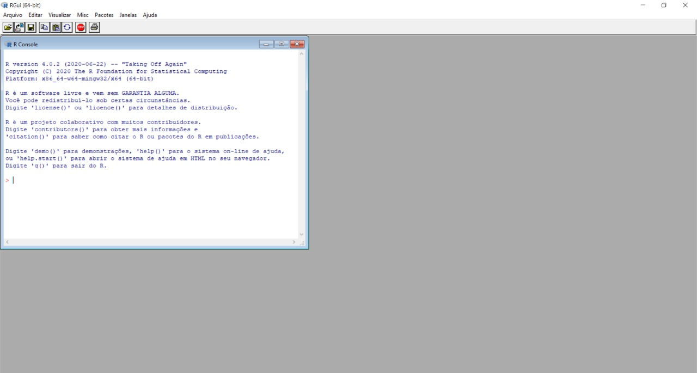
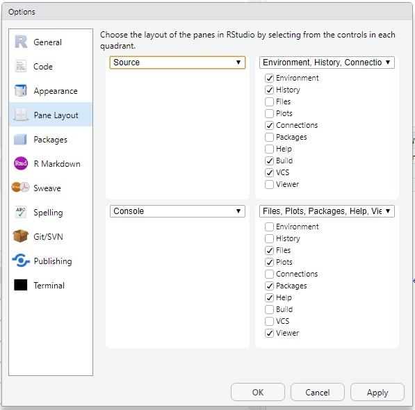

```{r setup, include=FALSE}
library(knitr)
```

## Visão geral do R e RStudio

### O que é a linguagem R

- <a href="https://bookdown.org/rdpeng/rprogdatascience/">R Programming for Data Science</a>, Roger D. Peng, 2019. Johns Hopkins Bloomberg School of Public Health.

### Porque usar o R em Hidrologia?

- Simplicidade da linguagem

- Excelente desempenho na manipulação de grandes bancos de dados

- Acesso a métodos estatísticos consolidados

- Acesso a diversas ferramentas de visualização de dados

- Acesso a métodos analíticos de ponta e ferramentas compartilhadas internacionalmente - não só pelo uso de pacotes, mas sobretudo, usando fóruns e tutoriais.

- <a href="https://hess.copernicus.org/articles/23/2939/2019/hess-23-2939-2019.pdf"> R in Hydrology </a>, Slater, et al., Hydrol. Earth Syst. Sci., 23, 2939–2963, 2019.

### Instalação do programa

```{r, echo = FALSE}
# Define variable containing url
urlR <- "https://www.r-project.org/logo/Rlogo.png"
urlRstudio <- "https://rstudio.com/wp-content/uploads/2018/10/RStudio-Logo-Flat.png"
```

Download de 2 programas: R e RStudio

- <a href="https://cran.r-project.org/bin/windows/base/"> R </a>

<center></center>

- <a href="https://rstudio.com/products/rstudio/download/"> R Studio </a>

<center></center>

*<font size="5">RStudio é uma plataforma com inúmeras ferramentas úteis e que roda a linguagem R. É possível usar só o R por sua interface, mas só é possível usar o RStudio com o R instalado na máquina.</font>*

### Interface do R e RStudio

Abaixo temos a interface do **R** quando o baixamos. Ele é de fato o programa que rodamos e programamos com ele.
<left></left>

Baixamos também o **RStudio**, ele é uma IDE (*Integrated Development Environment)*. Isso nada mais é do que um facilitador para usar o **R**, trazendo uma interface mais amigável para utilização dessa linguagem e algumas facilidades.
<left></left>

O layout é ajustável em `view -> Panes -> Pane Layout`
<left></left>

## Primeiros passos, comandos no R

Antes de tudo, é importante saber onde se está trabalhando! Para isso o **R** precisa saber em qual diretório está o programa e os possíveis dados que você for utilizar. Pra isso a gente tem os comandos:
- `getwd()`: vai informar qual diretório se está mexendo;
- `setwd()`: vai definir um diretório para usar no seu *script*;
- `dir()`: vai informar quais arquivos tem nesse diretório;
- `source()`: vai puxar e rodar um arquivo **R** com esse nome que está no diretório;

```{r, echo = TRUE}
#getwd()
#setwd("C:/cursoR")
#dir()
#source("soma.R")
```

R é utilizável como uma calculadora, com os operadores aritméticos que se conhece. Para multiplicação utilizamos `*`, para divisão `/`, para expoentes `^` e para raiz quadrada usamos `sqrt()` - do inglês *square root*.

```{r, echo = TRUE}
1 + 2
```

```{r, echo = TRUE}
12 * 5
```

```{r, echo = TRUE}
2 / 2
```

```{r, echo = TRUE}
12 ^ 4
```

```{r, echo = TRUE}
sqrt(9)
```

O R trabalha igualmente com vetores e escalares

```{r, echo = TRUE}
c(1, 3, 5, 7, 9) + c(2, 4, 6, 8, 10)
```

<font size="5">A função c() é usada para concatenar valores, criando vetores de valores da mesma classe.</font>

Ao usar o operador multiplicativo `*` o R entende que será feita a operação elemento a elemento. Para multiplicação de matrizes, o operador correto é `%*%`. Importante na vetorização!

```{r, echo = TRUE}
c(1, 3, 5, 7) * t(c(2, 4, 6, 8))
```

```{r, echo = TRUE}
c(1, 3, 5, 7) %*% t(c(2, 4, 6, 8))
```

### Criação de variáveis e atribuição de valores

A forma de se atribuir um valor a um elemento/objeto é utilizando o operador `<-`, da forma que deve ester algo dos dois lados dessa seta - de um o nome do objeto que irá receber o valor e do outro lado o próprio valor. Também é possível usar o operador `=` para fazer isso, porém não é recomendado.

```{r, echo = TRUE}
x <- 2
x
```

Se usarmos novamente o `x` para atribuir algum outro valor, esse será salvo por cima. Também podemos trocar a direção da seta, mas ela sempre deve apontar para o nome do objeto que vai receber o valor.

```{r, echo = TRUE}
-8 -> x
x
```

### Criação de variáveis e atribuição de valores

Pode-se atribuir, por exemplo, um valor não numérico a `x`.

```{r, echo = TRUE}
x <- "teste"
x
```

### Criação de variáveis e atribuição de valores

Alguns dos operadores que existem no R são: `<-`, `=` e `==`.
Como já comentado, os operadores `<-` e `=` podem ser usados para atribuir valores a variáveis/objetos, mas recomendamos utilizar smepre o `<-` porque o `=` também  serve para outras coisas (falaremos disso mais a frente quando formos criar funções!). Já o símbolo `==` funciona para avaliar uma igualdade e não de atribuir um valor a um elemento do R e retorna uma variável lógica, podendo ser `TRUE` ou `FALSE`. Por exemplo:

```{r, echo = TRUE}
x = 2
x == 2
```

```{r, echo = TRUE}
x == 3
```

### Criação de variáveis e atribuição de valores

Outros operadores que resultam em lógicos são:

```{r, echo = TRUE}
x != 2
```

```{r, echo = TRUE}
x < 3
```

```{r, echo = TRUE}
x >= 2
```

## Objetos do R

Existem diversas **Classes** de objetos dentro do R, alguns dos principais tipos são:

- Caractere (letras)
- Numérico (real)
- Inteiro
- Complexo
- Fator (classes)
- Lógico (`TRUE/FALSE`)

Para sabermos qual classe cada objeto é, podemos utilizar uma função interna ao **R** chamada `class()`. Usualmente, as funções vão sempre terminar com um parêntesis `()`, sendo que dentro dele botamos os argumentos da função - o que ela precisa (nesse caso, o objeto). Mais a frente falaremos com maiores detalhes sobre esses argumentos, funções em geral e até como criar uma sua.

```{r, echo = TRUE}
x <- 2
class(x)

y <- "oi"
class(y)

z <- TRUE
class(z)
```
 
A forma mais básica de armazenar objetos dessas classes é na forma de vetor e os vetores podem ser criados, com a função `c()` já utilizada antes. A regra geral é que os vetores só armazenam objetos de mesma classe. Para criarmos um objeto contendo vários tipos de classes diferentes, podemos utilizar objetos do tipo `list` e `dataframe`, como veremos mais à frente.

Via de regra, o R enverga números quando se utiliza um valor numérico. Para se criar uma variável do tipo inteiro (`integer`), deve-se acrescentar a letra `L` ao final:

```{r, echo = TRUE}
x <- 2L
class(x)
```

### Classes de vetores

Vetores só podem conter variáveis de um tipo. Abaixo colocamos três exemplos para três tipos de classes diferentes (numérico, lógico e caractere).

```{r, echo = TRUE}
x <- c(1, 2, 3, 4)
class(x)
```

```{r, echo = TRUE}
y <- c(FALSE, TRUE, T, F)
y
print(y)
class(y)
```

```{r, echo = TRUE}
x <- c("ola", "bom", "dia", "programadores")
x
class(x)
```

### Fatores

O `factor` é uma importante classe de elemento no R para definir variáveis categóricas. São úteis em modelos de regressão linear com variáveis categóricas de entrada (estações do ano, classes de solo, cotas de alerta hidrológico etc.):

```{r, echo=TRUE}
x <- factor(c("normal","atenção","alerta","inundação","inundação severa","inundação","atenção","normal","inundação","normal","alerta","atenção"))
x
table(x)
```

### Coerção de variáveis

Quando se tem diferentes tipos de classes dentro de um vetor, é feita uma coerção automática para que tudo fique com a mesma classe. Dessa forma, ao criar um vetor contendo dados do tipo caractere e numérico, o **R** supõe que todas as informações eram para ser do tipo caractere:

```{r, echo = TRUE}
x <- c("ola", 1, "dia", 2)
x
class(x)
```

Podemos forçar uma coerção no **R**, a chamada **Coerção explícita**. Fazemos isso utilizando funções do tipo:
- as.numeric() ;
- as.character() ;
- as.logical() ;
- as.factor() ;
- as.complex() ...

Com elas o **R** vai transformar o vetor (ou objeto) em questão no tipo que você definiu. Isso pode ser uma tarefa simples ou complicada pro programa. No exemplo abaixo, transformar tudo em caractere é relativamente fácil, o **R** apenas assume que o número é um *string* (um caractere). Dessa forma não conseguimos fazer operações aritméticas com ele, mas conseguimos fazer alguns tratamentos utilizados em texto.

```{r, echo = TRUE}
x <- as.character(3)
x
class(x)

x + 1
```

Pdemos fazer a mesma coerção para que o vetor seja numérico. Assim iremos transformar tudo dentro do vetor como classe numérico. Nesse caso, a tarefa pro **R** é complicada.. afinal, como transformar "ola" em um número? Nesses casos, no lugar é retornado um valor `NA` (*Not Available*):

```{r, echo = TRUE}
x <- as.numeric(c("ola", 1, "dia", 2))
x
class(x)
```

### Sequências

Para criar vetores sequenciais podemos fazer manualmente.

```{r, echo = TRUE}
x <- c(1, 2, 3, 4, 5, 6, 7, 8, 9, 10)
x
```

Também podemos utilizar o símboblo `:` para facilitar. Assim a sequência é gerada somando um a um.
```{r, echo = TRUE}
x <- c(1:10)
x
```

Existe também funções para isso, como a função `seq()`. Com o primeiro valor sendo em qual número começamos a sequência e o segundo sendo até onde a sequêcia deve ir, sempre indo de 1 em 1.

```{r, echo = TRUE}
x <- seq(1, 10)
x
```

Essa função pode utilizar 3 valores. O terceiro é o tamanho do passo a ser dado, abaixo é feita uma sequência de 1 a 10, andando de 4 em 4. Ele não vai retornar 10 porque a sequência não passa por ele (ela seria 1, 5, 9, 13, 17...), mas vai retornar o maior número antes do segundo colocado dentro do `seq()`.

```{r, echo = TRUE}
x <- seq(1, 10, 4)
x
```

### *Indexing*

Para selecionar um valor específico dentro de um vetor, se usa colchetes `[]`. Assim, se quiser o primeiro elemento do vetor `x` eu escrevo `x[1]`. O mesmo vale para selecionar o primeiro, segundo e quinto elemento, escreveria `x[c(1, 2, 5)]`.
```{r, echo = TRUE}
x <- c(11:20)
x
x[1]
x[c(1, 2, 5)]

```

### Operações em ou com vetores

Podemos fazer operações com vetores igual faziamos com números no começo. Os mesmos operadores são utilizados aqui. Por exemplo, se quisermos dobrar os valores de um vetor, podemos simplesmente fazer `2*` esse vetor. Em geral as operações aritméticas feitas em um vetor são feitas elementos a elementos. Para realizar operações matriciais a notação muda um pouco.

```{r, echo=TRUE}
x <- c(1:5)
2*x
```

```{r, echo=TRUE}
sqrt(2*x/4)
```

É possível inclusive fazer operações entre vetores. Porém, caso os vetores não sejam do mesmo tamanho teremos um problema ao fazer a operação elemento a elemento (vai acabar faltando algum). O **R**, nesse caso, vai fazer a operação até onde ele conseguir e irá retornar uma mensagem de aviso (*Warning*) - mas a conta será feita! Abaixo tentamos somar os vetores `x` e `y`. Como o vetor `y` tem um elemento a menos que `x`, a soma vai ser feita normalmente para os primeiros 4 elementos de `x`, ao fazer o quinto, porém, o **R** vai voltar ao inicio do `y` - somando então o quinto elemento de `x` com o primeiro do `y`.

```{r, echo=TRUE}
y <- c(1:4)
x + y
```

Podemos misturar essas operações com o *indexing* comentado anteriormente. Por exemplo, se quisermos saber quais valores do vetor `x` são maiores que 6 posso escrever como abaixo. É retornado apenas uma sequência de valores `TRUE` ou `FALSE` para cada elemento do vetor.

```{r, echo=TRUE}
x > 6
```

Se quiser saber quantos valores dentro do meu vetor são maiores do que 6, ao invés de contar na mão posso usar a função `sum()`! Isso acontece porque os valores lógicos também funcionam como número, valores `TRUE` são equivalentes a 1 e valores `FALSE` são iguais a 0. Assim somando os valores `TRUE`, conseguimos saber quantos números dentro do vetor `x` são maiores que 6.

```{r, echo=TRUE}
sum(x > 6)
```

Abaixo, fazemos quais são os valores desse vetor que são maiores do que 6.

```{r, echo=TRUE}
x[x > 6]
```

## Outros tipos de dados (Data Frames, matrizes e listas)

### Data Frames

- `matrix`: todos os elementos são da mesma classe;
- `list`: cada elemento pode pertencer a uma classe diferente.
- `data.frame`: dentro de cada coluna, os objetos pertencem à mesma classe, mas diferentes colunas podem pertencer a diferentes classes;

Quando são lidos objetos externos (planilhas excel, arquivos .txt ou .csv), usando as funções do R `read.table()` ou `read.csv()`, por exemplo, o objeto criado é um `data.frame`.

A classe de `data.frame` é muito utilizada em R. É o que se utiliza para dados tabulados. Além disso, todos os elementos do `data.frame` têm o mesmo comprimento.

```{r, echo = TRUE}
DF <- data.frame(x = c(1:3), coluna_2 = c("A", "B", "C"))
DF
class(DF)
```

Coerção de classe para `data.frame`.

```{r, echo = TRUE}
m <- matrix(c(1:9), nrow = 3)
m <- as.data.frame(m)
m
```

Coerção de classe para `data.frame`.

```{r, echo = TRUE}
m <- matrix(c(1:9), nrow = 3); attributes(m)
attributes(as.data.frame(m))
```

### Matrizes

Matrizes são objetos objetos semelhantes a vetores, entretanto, com o atributo dimensão `dim`.

```{r, echo = TRUE}
m <- matrix(nrow = 2, ncol = 3); m
attributes(m)
```

Matrizes podem ser criadas a partir de vetores, adicionando o atribuito dimensão.

```{r, echo = TRUE}
m <- matrix(x, nrow = 2, ncol = 5); m
m <- matrix(x, nrow = 2, ncol = 5, byrow = TRUE); m
```

Para selecionar elementos de uma matriz, é necessário especificar as duas dimensões:

```{r, echo = TRUE}
m <- matrix(1:4, nrow = 2); m
m[2,2]
```

Selecionar elementos de matrizes quadradas:

```{r, echo = TRUE}
lower.tri(m)
upper.tri(m)
```

Selecionar elementos de matrizes quadradas:

```{r, echo = TRUE}
m[lower.tri(m)] <- NA; m
diag(m) <- NA; m
```

Vetores podem ser unidos a fim de criar uma matriz:

```{r, echo = TRUE}
x <- c(1:10)
y <- rnorm(10, 10, 5)
uniao <- cbind(x, y)
uniao
dim(uniao)
```

A função `cbind()` adiciona colunas as matrizes.

Vetores podem ser unidos a fim de criar uma matriz:

```{r, echo = TRUE}
x <- c(1:10)
y <- rnorm(10, 20, 5)
uniao <- rbind(x, y)
uniao
dim(uniao)
```

A função `rbind()` adiciona linhas as matrizes.

### Listas

Listas são elementos importantes na programação em R. Uma das vantagens de se saber utilizar bem esse tipo de elemento é que nelas é possível armazenar elementos de diferentes tipos (caracter, número real, inteiro, complexo, lógico).

Elas são diferentes dos vetores que, via de regra, só armazenam objetos de mesma classe.

Para criar uma lista:

```{r, echo=TRUE}
x <- list(1, "Ola", 1+5i, TRUE, 4L)
x
```

Para selecionar dados de listas, utiliza-se o duplo cochete `[[]]`:

```{r, echo=TRUE}
x <- list(c(1,2,3), c("Ola", "Mundo"), 1+5i, TRUE, 4L)
x[[1]]
x[[2]][2]
x[[5]] + 6
```

## Programação Básica

### Funções
Uma coisa essencial em qualquer linguagem de programação é a criação e utilização de funções. O **R** (assim como outras linguagens) já vem com diversas funções instaladas nele mesmo - chamamos isso de **R base**. Por exemplo, se quisermos calcular o `log` de algum valor, podemos utilizar a função `log()` colocando dentro do parênteses o valor que queremos.

```{r, echo = TRUE}
log(10)
```

Para saber o que é preciso colocar dentro dos parênteses, ou seja, quais os argumentos (*inputs*) que cada função toma, podemos utilizar a função `args()`. Usando ela com o log (dessa vez sem parênteses) dentro, podemos ver que a função toma dois argumentos: o `x` (valor em que se calcula o logaritmo) e a `base` que já vem com um valor definido de exponencial. Para se ter mais informações sobre alguma função, podemos, além de usar `args()` utilizar uma interrogação anterior ao nome da função (sem parêntesis), ou usar a função `help()`. Essas duas últimas opções são equivalentes e nos mostram a documentação feita para essa função no **R**.

```{r, echo = TRUE}
args(log))
?log
help(log)
```

O segundo argumento do `log()` pode ser modificado, basta deixar ele explícito ao chamar a função. Não precisamos escrever qual argumento estamos utilizando desde que se siga a ordem da função (mostrada anteriormente). Caso se queira escrever os argumentos em outra ordem, é possível, mas é necessário escrever cada um deles. Veja melhor o exemplo abaixo. O primeiro não definimos a base, portanto é usada a pré definida (exponencial). No segundo log feito, não escrevemos qual a base e qual o número que queremos o logaritmo, portanto o **R** assume que estamos escrevendo na ordem da função, que toma como primeiro argumento o valor e o segundo argumento a base. No terceiro exemplo trocamos as ordens dos argumentos, mas para isso precisamos deixar explícito (escrito) quem é cada um.

```{r, echo = TRUE}
log(100)
log(100, 10)
log(base = 10, x = 100)
```

Agora vamos fazer nossa própria função dentro do **R**. Para isso, primeiro definimos um nome para ser o nome da função (como fizemos com criação de variáveis / objetos), por exemplo "fun_area_circulo". Em seguida devemos dizer que vamos criar uma função e quais os argumentos que ela toma. Para fazer o exemplo, a área de um círculo, precisamos apenas de uma informação - o raio desse círculo. Podemos fazer quantas operações quisermos dentro da função, no final o último valor será retornado por ela (podemos deixar isso explícito escrevendo `return`) nela. Depois chamamos ela como qualquer outra função!

```{r, echo = TRUE}
fun_area_circulo <- function(raio){
  x <- 2*pi*raio
  return(x)
}

fun_area_circulo(5)
```

### Estruturas condicionais (ifelse)

Em programação, algo extremamente importante e útil são os comandos `if` e `else` (*e* / *se*). Com esses comandos, é possível rodar um código apenas se uma condição for cumprida. Esse comando no **R** funciona similar a uma função, sendo então o `ifelse()` (tudo junto!), e toma três argumentos - um lógico (uma condição), o que fazer se o lógico for `TRUE` e o que fazer se o lógico for `FALSE`. Abaixo fazemos um exemplo utilizando o `ifelse` para verificar se o `X` é maior ou menor do que 100.

```{r, echo = TRUE}
x <- 10
ifelse(x < 100, "X é menor que 100", "X é maior ou igual a 100")
```

```{r, echo = TRUE}
x <- 1000
ifelse(x < 100, "X é menor que 100", "X é maior ou igual a 100")
```

É possível usar também só o `if` como um comando. Em seguida rodamos um código para que, se o X for um número não inteiro, arredondamos ele e em seguida o  transformamos em inteiro. 

```{r, echo = TRUE}
x <- 3.7
if(class(x) != "integer") x <- as.integer(round(x))
class(x)
```

### Loops (for e while)

A última coisa a se falar do **R** "básico" é a construção de *loops*. Eles são utilizados quando queremos repetir a mesma coisa várias vezes.

#### for

O `for()` utiliza 2 argumentos. O primeiro fala qua objeto vai ser iterado várias vezes, e o outro a faixa de valores (quantas vezes ele vai ser iterado praticamente). No exemplo abaixo vamos por exemplo variar o `i` (criado dentro do próprio *loop*) na sequência de 1 até 5. Isso é o mais importante desse tipo de *loop*, **precisamos** saber quantas vezes (`1:5`) iterar essa variável (nesse caso `i`). O resto da função é simplesmente o que vai ser iterado. No exemplo abaixo apenas printamos o valor de `i` quando ele varia de 1 a 5.

```{r, echo = TRUE}
for(i in 1:5){
  print(i)
}
```

#### while

Diferente do `for`, utilizamos o `while` quando não sabemos *a priori* quando queremos terminar nosso *loop*. Ou seja, vamos ficar repetindo o que foi feito até certa condição ser cumprida. No exemplo abaixo, printamos na tela o valor de `i`, sendo que a cada "rodada" aumentamos o valor de `i` em uma unidade. Isso é feito até o `i` ser menor ou igual a 5, por exemplo.

```{r, echo = TRUE}
i <- 0

while(i <= 5){
  print(i)
  i <- i + 1
}
```
