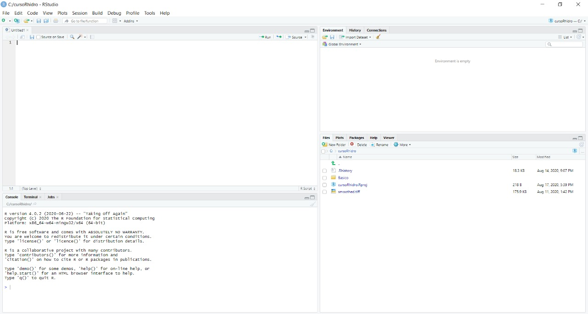

```{r setup, include=FALSE}
library(knitr)
```

## Visão geral do R e RStudio

### **O que é a linguagem R **

- <a href="https://bookdown.org/rdpeng/rprogdatascience/">R Programming for Data Science</a>, Roger D. Peng, 2019. Johns Hopkins Bloomberg School of Public Health.

## Porque usar o R em Hidrologia?

- Simplicidade da linguagem

- Excelente desempenho na manipulação de grandes bancos de dados

- Acesso a métodos estatísticos consolidados

- Acesso a diversas ferramentas de visualização de dados

- Acesso a métodos analíticos de ponta e ferramentas compartilhadas internacionalmente - não só pelo uso de pacotes, mas sobretudo, usando fóruns e tutoriais.

- <a href="https://hess.copernicus.org/articles/23/2939/2019/hess-23-2939-2019.pdf"> R in Hydrology </a>, Slater, et al., Hydrol. Earth Syst. Sci., 23, 2939–2963, 2019.

## Instalação do programa

```{r, echo = FALSE}
# Define variable containing url
urlR <- "https://www.r-project.org/logo/Rlogo.png"
urlRstudio <- "https://rstudio.com/wp-content/uploads/2018/10/RStudio-Logo-Flat.png"
```

Download de 2 programas: R e RStudio

- <a href="https://cran.r-project.org/bin/windows/base/"> R </a>

<center></center>

- <a href="https://rstudio.com/products/rstudio/download/"> R Studio </a>

<center></center>

*<font size="5">RStudio é uma plataforma com inúmeras ferramentas úteis e que roda a linguagem R. É possível usar só o R por sua interface, mas só é possível usar o RStudio com o R instalado na máquina.</font>*

## Interface do R e RStudio

<left></left>

## Interface do R e RStudio

<left></left>

## Interface do R e RStudio

O layout é ajustável em `view -> Panes -> Pane Layout`

<left></left>

## Primeiros passos

### **Comandos no R **

Antes de tudo, é importante saber onde se está trabalhando!

```{r, echo = TRUE}
#getwd();setwd("C:/cursoR")
#dir()
#source("soma.R")
```

## Comandos no R

R é utilizável como uma calculadora

```{r, echo = TRUE}
#setwd("C:/cursoR/Basico")
1 + 2
```

```{r, echo = TRUE}
12 * 5
```

```{r, echo = TRUE}
2 / 2
```

```{r, echo = TRUE}
12 ** 4
```

```{r, echo = TRUE}
12 ^ 4
```

## Comandos no R

O R trabalha igualmente com vetores e escalares

```{r, echo = TRUE}
c(1, 3, 5, 7, 9) + c(2, 4, 6, 8, 10)
```

<font size="5">A função c() é usada para concatenar valores, criando vetores de valores da mesma classe.</font>

## Comandos no R

Ao usar o operador multiplicativo `*` o R entende que será feita a operação elemento a elemento. Para multiplicação de matrizes, o operador correto é `%*%`. Importante na vetorização!

```{r, echo = TRUE}
c(1, 3, 5, 7) * t(c(2, 4, 6, 8))
```

```{r, echo = TRUE}
c(1, 3, 5, 7) %*% t(c(2, 4, 6, 8))
```

## Criação de variáveis e atribuição de valores

A forma de se atribuir um valor a um elemento/objeto é utilizando o operador `<-`, da forma que deve ester algo dos dois lados dessa seta - de um o nome do objeto que irá receber o valor e do outro lado o próprio valor. Também é possível usar o operador `=` para fazer isso, porém não é recomendado.

```{r, echo = TRUE}
x <- 2
x
```

Se usarmos novamente o `x` para atribuir algum outro valor, esse será salvo por cima. Também podemos trocar a direção da seta, mas ela sempre deve apontar para o nome do objeto que vai receber o valor.

```{r, echo = TRUE}
-8 -> x
x
```

## Criação de variáveis e atribuição de valores

Pode-se atribuir, por exemplo, um valor não numérico a `x`.

```{r, echo = TRUE}
x <- "teste"
x
```

## Criação de variáveis e atribuição de valores

Alguns dos operadores que existem no R são: `<-`, `=` e `==`.
Como já comentado, os operadores `<-` e `=` podem ser usados para atribuir valores a variáveis/objetos, mas recomendamos utilizar smepre o `<-` porque o `=` também  serve para outras coisas (falaremos disso mais a frente quando formos criar funções!). Já o símbolo `==` funciona para avaliar uma igualdade e não de atribuir um valor a um elemento do R e retorna uma variável lógica, podendo ser `TRUE` ou `FALSE`. Por exemplo:

```{r, echo = TRUE}
x = 2
x == 2
```

```{r, echo = TRUE}
x == 3
```

## Criação de variáveis e atribuição de valores

Outros operadores que resultam em lógicos são:

```{r, echo = TRUE}
x != 2
```

```{r, echo = TRUE}
x < 3
```

```{r, echo = TRUE}
x >= 2
```

## Objetos do R

Existem diversas **Classes** de objetos dentro do R, alguns dos principais tipos são:

- Caractere (letras)
- Numérico (real)
- Inteiro
- Complexo
- Fator (classes)
- Lógico (`TRUE/FALSE`)

Para sabermos qual classe cada objeto é, podemos utilizar uma função interna ao **R** chamada `class()`. Usualmente, as funções vão sempre terminar com um parêntesis `()`, sendo que dentro dele botamos os argumentos da função - o que ela precisa (nesse caso, o objeto). Mais a frente falaremos com maiores detalhes sobre esses argumentos, funções em geral e até como criar uma sua.

```{r, echo = TRUE}
x <- 2
class(x)

y <- "oi"
class(y)

z <- TRUE
class(z)
```
 
A forma mais básica de armazenar objetos dessas classes é na forma de vetor e os vetores podem ser criados, com a função `c()` já utilizada antes. A regra geral é que os vetores só armazenam objetos de mesma classe. Para criarmos um objeto contendo vários tipos de classes diferentes, podemos utilizar objetos do tipo `list` e `dataframe`, como veremos mais à frente.

## Objetos do R

Via de regra, o R enverga números quando se utiliza um valor numérico. Para se criar uma variável do tipo inteiro (`integer`), deve-se acrescentar a letra `L` ao final:

```{r, echo = TRUE}
x <- 2L
class(x)
```

## Objetos do R - coerção de variáveis

Vetores só podem conter variáveis de um tipo:

```{r, echo = TRUE}
x <- c(1, 2, 3, 4)
class(x)
```

```{r, echo = TRUE}
y <- c(FALSE, TRUE, T, F)
y
print(y)
class(y)
```

## Objetos do R - coerção de variáveis

Vetores só podem conter variáveis de um tipo:

```{r, echo = TRUE}
x <- c("ola", "bom", "dia", "programadores")
x
class(x)
```

## Objetos do R - coerção de variáveis

Quando se tem diferentes tipos de classes dentro de um vetor, é feita uma coerção automática para que tudo fique com a mesma classe. Dessa forma, ao criar um vetor contendo dados do tipo caractere e numérico, o **R** supõe que todas as informações eram para ser do tipo caractere:

```{r, echo = TRUE}
x <- c("ola", 1, "dia", 2)
x
class(x)
```

**COERÇÃO IMPLÍCITA**

## Objetos do R - coerção de variáveis

Coerção explícita:

```{r, echo = TRUE}
x <- as.character(c("ola", 1, "dia", 2))
x
class(x)
```

## Objetos do R - coerção de variáveis

Coerção explícita:
Ao deixarmos explícito para o **R** que o vetor deve ser numérico, ele irá transformar tudo dentro do vetor como numérico. Às vezes o R não consegue fazer essa coerção (como transformar "ola" em um número?) e então retorna `NA` (Not Available):

```{r, echo = TRUE}
x <- as.numeric(c("ola", 1, "dia", 2))
x
class(x)
```

## Objetos do R - Vetores

Para criar vetores sequenciais:

```{r, echo = TRUE}
x <- c(1, 2, 3, 4, 5, 6, 7, 8, 9, 10)
x

```

```{r, echo = TRUE}
x <- c(1:10)
x
```

```{r, echo = TRUE}
x <- seq(1, 10)
x
```

```{r, echo = TRUE}
x <- seq(1, 10, 3)
x
```

```{r, echo = TRUE}
x <- vector("numeric", length = 10)
x
```

## Objetos do R - Vetores

Para criar vetores:

```{r, echo = TRUE}
x <- c(11:20)
x
x[c(1,5,10)]
x[c(4,8,11)]
dim(x)
```
## Objetos do R - Matrizes

Matrizes são objetos objetos semelhantes a vetores, entretanto, com o atributo dimensão `dim`.

```{r, echo = TRUE}
m <- matrix(nrow = 2, ncol = 3); m
attributes(m)
```

## Objetos do R - Matrizes

Matrizes podem ser criadas a partir de vetores, adicionando o atribuito dimensão.

```{r, echo = TRUE}
m <- matrix(x, nrow = 2, ncol = 5); m
m <- matrix(x, nrow = 2, ncol = 5, byrow = TRUE); m
```

## Objetos do R - Matrizes

Para selecionar elementos de uma matriz, é necessário especificar as duas dimensões:

```{r, echo = TRUE}
m <- matrix(1:4, nrow = 2); m
m[2,2]
```

## Objetos do R - Matrizes

Selecionar elementos de matrizes quadradas:

```{r, echo = TRUE}
lower.tri(m)
upper.tri(m)
```

## Objetos do R - Matrizes

Selecionar elementos de matrizes quadradas:

```{r, echo = TRUE}
m[lower.tri(m)] <- NA; m
diag(m) <- NA; m
```
## Objetos do R - Matrizes

Vetores podem ser unidos a fim de criar uma matriz:

```{r, echo = TRUE}
x <- c(1:10)
y <- rnorm(10, 10, 5)
uniao <- cbind(x, y)
uniao
dim(uniao)
```

A função `cbind()` adiciona colunas as matrizes.

## Objetos do R - Matrizes

Vetores podem ser unidos a fim de criar uma matriz:

```{r, echo = TRUE}
x <- c(1:10)
y <- rnorm(10, 20, 5)
uniao <- rbind(x, y)
uniao
dim(uniao)
```

A função `rbind()` adiciona linhas as matrizes.

## Operações em ou com vetores

Podemos fazer operações com vetores igual faziamos com números no começo. Os mesmos operadores são utilizados aqui. Por exemplo, se quisermos dobrar os valores de um vetor, podemos simplesmente fazer `2*` esse vetor. Em geral as operações aritméticas feitas em um vetor são feitas elementos a elementos. Para realizar operações matriciais a notação muda um pouco.

```{r, echo=TRUE}
x <- c(1:5)
2*x
```

```{r, echo=TRUE}
sqrt(2*x/4)
```

É possível inclusive fazer operações entre vetores. Porém, caso os vetores não sejam do mesmo tamanho teremos um problema ao fazer a operação elemento a elemento (vai acabar faltando algum). O **R**, nesse caso, vai fazer a operação até onde ele conseguir e irá retornar uma mensagem de aviso (*Warning*) - mas a conta será feita! Abaixo tentamos somar os vetores `x` e `y`. Como o vetor `y` tem um elemento a menos que `x`, a soma vai ser feita normalmente para os primeiros 4 elementos de `x`, ao fazer o quinto, porém, o **R** vai voltar ao inicio do `y` - somando então o quinto elemento de `x` com o primeiro do `y`.

```{r, echo=TRUE}
y <- c(1:4)
x + y
```

## Operações em ou com vetores

```{r, echo=TRUE}
x <- c(1:12); names(x) <- month.abb
x
```

```{r, echo=TRUE}
x[1]
x["Jan"]
```

## Operações em ou com vetores

```{r, echo=TRUE}
x > 6
x[x > 6]
sum(x > 6)
```
## Objetos do R - Listas

Listas são elementos importantes na programação em R. Uma das vantagens de se saber utilizar bem esse tipo de elemento é que nelas é possível armazenar elementos de diferentes tipos (caracter, número real, inteiro, complexo, lógico).

Elas são diferentes dos vetores que, via de regra, só armazenam objetos de mesma classe.

## Objetos do R - Listas

Para criar uma lista:

```{r, echo=TRUE}
x <- list(1, "Ola", 1+5i, TRUE, 4L)
x
```

## Objetos do R - Listas

Para selecionar dados de listas, utiliza-se o duplo cochete `[[]]`:

```{r, echo=TRUE}
x <- list(c(1,2,3), c("Ola", "Mundo"), 1+5i, TRUE, 4L)
x[[1]]
x[[2]][2]
x[[5]] + 6
```

## Objetos do R - Fatores

O `factor` é uma importante classe de elemento no R para definir variáveis categóricas. São úteis em modelos de regressão linear com variáveis categóricas de entrada (estações do ano, classes de solo, cotas de alerta hidrológico etc.):

```{r, echo=TRUE}
x <- factor(c("normal","atenção","alerta","inundação","inundação severa","inundação","atenção","normal","inundação","normal","alerta","atenção"))
x
table(x)
```

## Objetos do R - Data Frames

- `matrix`: todos os elementos são da mesma classe;
- `list`: cada elemento pode pertencer a uma classe diferente.
- `data.frame`: dentro de cada coluna, os objetos pertencem à mesma classe, mas diferentes colunas podem pertencer a diferentes classes;

Quando são lidos objetos externos (planilhas excel, arquivos .txt ou .csv), usando as funções do R `read.table()` ou `read.csv()`, por exemplo, o objeto criado é um `data.frame`.

## Objetos do R - Data Frames

A classe de `data.frame` é muito utilizada em R. É o que se utiliza para dados tabulados. Além disso, todos os elementos do `data.frame` têm o mesmo comprimento.

```{r, echo = TRUE}
DF <- data.frame(x = c(1:3), coluna_2 = c("A", "B", "C"))
DF
class(DF)
```

## Objetos do R - Data Frames

Coerção de classe para `data.frame`.

```{r, echo = TRUE}
m <- matrix(c(1:9), nrow = 3)
m <- as.data.frame(m)
m
```
## Objetos do R - Atributos

Coerção de classe para `data.frame`.

```{r, echo = TRUE}
m <- matrix(c(1:9), nrow = 3); attributes(m)
attributes(as.data.frame(m))
```

## Programação Básica - Criando funções

Uma coisa essencial em qualquer linguagem de programação é a criação e utilização de funções. O **R** (assim como outras linguagens) já vem com diversas funções instaladas nele mesmo - chamamos isso de **R base**. Por exemplo, se quisermos calcular o `log` de algum valor, podemos utilizar a função `log()` colocando dentro do parênteses o valor que queremos.

```{r, echo = TRUE}
log(10)
```


## Programação Básica - Estruturas condicionais (ifelse)

Em programação, algo extremamente importante e útil são os comandos `if` e `else` (*e* / *se*). Com esses comandos, é possível rodar um código apenas se uma condição for cumprida. Esse comando no **R** funciona similar a uma função, sendo então o `ifelse()` (tudo junto!), e toma três argumentos - um lógico (uma condição), o que fazer se o lógico for `TRUE` e o que fazer se o lógico for `FALSE`. Abaixo fazemos um exemplo utilizando o `ifelse` para verificar se o `X` é maior ou menor do que 100.

```{r, echo = TRUE}
x <- 10
ifelse(x < 100, "X é menor que 100", "X é maior ou igual a 100")
```

```{r, echo = TRUE}
x <- 1000
ifelse(x < 100, "X é menor que 100", "X é maior ou igual a 100")
```

É possível usar também só o `if` como um comando. Em seguida rodamos um código para que, se o X for um número não inteiro, arredondamos ele e em seguida o  transformamos em inteiro. 

```{r, echo = TRUE}
x <- 3.7
if(class(x) != "integer") x <- as.integer(round(x))
class(x)
```

## Programação Básica - Loops (for e while)


 
## Input/output

É imprescindível que a gente entenda como ler informações hidrológicas dos mais diversos tipos de arquivo, assim como aprender como escrever os resultados de nossas análises de forma organizada em aruivos de diferentes formatos para que possamos comunicar nossos resultados e para que outros possam avaliar e/ou continuar nossas análises.

Para isso, investiremos um tempo discutindo algumas maneiras de ler e escrever em arquivos fazendo uso de funções do R.

### Construção de gráficos

## Alguns pacotes

