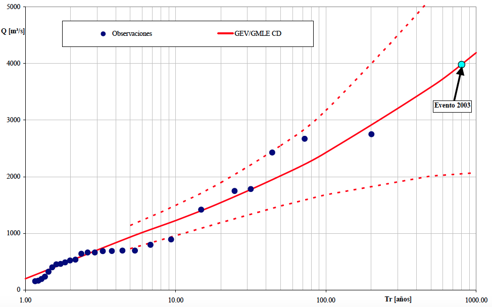

```{r setup, include=FALSE}
library(knitr)
library(tidyverse)
library(dplyr)
library(XML)
library(lubridate)
```

## Objetivos da atividade

O objetivo desta atividade é realizar uma análise de frequência de cheias a nível local. Isso significa que iremos relacionar a magnitude das vazões máximas anuais com a probabilidade da mesma ser excedida.  A análise a nível local siginifca que utilizaremos apenas as informações de vazão observadas na estação fluviométrica de interesse, sem fazer uso de informações sobre as vazões máximas anuais que teham acontecido em outras estações fluviométricas localizadas na região. 

Além de construirmos a relação entre a magnitude das vazões máximas anuais e a respectiva probabilidade de excedência, é importante saber estimar também o grau de incerteza nessas estimativas. Essas incertezas são usualmente representadas por intervalos de confiança, como veremos mais adianate. 

Além de calcular essas quantidades, a curva de frequência, e suas respectivas incertezas, são representadas graficamente, como na figura abaixo, que mostra os resultados para um estudo de cheias numa seção do Rio Salado, localizada na província de Santa Fé, na Argentina, onde em 2003 ocorreu o rompimento de um dique que resultou em perde de vidas humanas e elevados prejuízos.  

Contruiremos aqui no curso uma figura semelhante a esta, onde no eixo-x temos o tempo de recorrência e no eixo-y a magnitude das vazões máximas anuais. O tempo de recorrência apresentado no eixo-x é uma maneira de representar a probabilidade de excedência. A linha cheia em vermelho representa o valor esperado dos valores da vazão máxima anual em função do tempo de recorrência, enquanto as linhas tracejadas representam os intervalos de confiança de 95%, ilustrando as incertezas envolvidas nessas estimativas. Os círculos azuis escuros representam as vazões máximas anuais registradas no passado, enquanto o círculo azul claro mostra a cheia destruidora de 2003. 

```{r curva_freq,echo=FALSE, fig.align = 'center', out.width = "90%", fig.cap = "Curva de frequência do cheias do Rio Salado, na Argentina."}

```

## Seleção das vazões máximas anuais

O primeiro passo de nossa atividade consiste em obter a série de máximos anuais que desejamos analisar. A obtenção da série de máximos anuais será realizada em duas etapas. Primeiro vamos obter a séries de vazões diárias, e para isso utilizaremos a mesma função de obtenção de séries diárias de vazão que aprendemos na segunda aula desta curso. Com a série diária em mãos, passaremos para a segunda etapa,, que é a de extrair a vazão máxima de cada ano hidrológico.

A função abaixo permite obter a série de vazões diárias de uma estação fluviométrica. A função devolve as informações num dataframe com 3 colunas: o código da estação, a data, e o valor da vazão diária. 

```{r dados_hidro_ANA_2}
# Função para obter série histórica de vazão de uma determinada estação ####
dados_serie_ANA <- function(cod_estacao = NA,
                            data_inicio = "01/01/1800",
                            data_fim = Sys.Date(),
                            tipo_dados = 3,
                            nivel_consist = 1){
  
  # Pegar dados a partir do url e transformar em um dataframe
  url_base <-
    paste0("http://telemetriaws1.ana.gov.br/ServiceANA.asmx/",
           "HidroSerieHistorica?",
           "codEstacao=", cod_estacao,
           "&dataInicio=", data_inicio,
           "&dataFim=", data_fim,
           "&tipoDados=", tipo_dados,
           "&nivelConsistencia=", nivel_consist)
  
  url_parse <- XML::xmlParse(url_base, encoding = "UTF-8")
  node_doc <- XML::getNodeSet(url_parse, "//SerieHistorica")
  dados_estacao <- XML::xmlToDataFrame(nodes = node_doc)
  
  # Por algum motivo o hidroweb não está filtrando os dados pela consistencia
  dados_estacao <- filter(dados_estacao, NivelConsistencia == nivel_consist)
  
  # Separar data e hora
  dados_estacao$Data <- as.Date(substr(dados_estacao$DataHora, 1, 10))
  dados_estacao$Hora <- substr(dados_estacao$DataHora, 12, 19)
  
  # Fazer um dataframe só com datas e valores de vazão
  datas_dia <- seq.Date(from = min(dados_estacao$Data),
                        to = max(dados_estacao$Data) %m+% months(1) - 1,
                        by = "day")
  
  tabela_final <- data.frame(Cod_estacao = dados_estacao$EstacaoCodigo[1],
                             Data = as.character(datas_dia),
                             Vazao = as.numeric(NA))
  
  
  for(i in 1:nrow(tabela_final)){
    # Dia em análise
    dia <- as.numeric(substr(tabela_final$Data[i], 9, 10))
    
    # Mês e ano em análise
    mes_ano <- as.Date(paste0(substr(tabela_final$Data[i], 1, 8), "01"))
    
    # Olhar a linha do mes e ano e escolher a coluna pelo dia + 15
    linha_dado <- which(dados_estacao$Data == mes_ano)
    
    # Se não tiver o mês nos dados da estação, colocar valor NA
    ifelse(length(linha_dado) == 0,
           tabela_final$Vazao[i] <- NA,
           tabela_final$Vazao[i] <-
             as.numeric(dados_estacao[linha_dado, (dia + 15)]))
    
  }
  
  return(tabela_final)
}
```

Vamos focar nossa análise de frequência na estação **60435000**, localizada na bacia do Rio Descoberto, que drena uma área de $113.2$ km^2.

Para obter a série diária, basta chamar a função acima passando o argumento necessário, que é simplesmente o código da estação desejada. A função devolve um dataframe com a série de máximos anuais. Para fins de visualização, utilizamos a função `head(nome_do_dataframe)` do R, como mostrado abaixo, que nos mostra as primeiras 6 linhas do dataframe.

```{r dados_FAL_2}
dados_60435000 <- dados_serie_ANA(cod_estacao = 60435000)
head(dados_60435000)
```

Pode-se notar que nos seis primeiros dias dos dados, que se inicia em maio de 1978, não temos valores registrados de vazão. 

Com a série de vazões diárias, passamos ao segundo passo que é o de construir a série de máximos anuais com base no ano hidrológico. Para isso, utilizaremos uma outra função, que é apresentada abaixo. Veja que a função internamente considera o ano hidrológico com início no mês de agosto. O mês de início do ano hidrológico pode ser facilmente alterado, se for o desejo do analista. Uma outra solução seria reesecrever a função incluindo como argumento o mês de início do ano hidrológico.

```{r}
# Contrução da série de máximos anuais a partir de um ano hidrológico ####
fun_max_ano <- function(tabela = NA,
                        comeco_ano_hidro = 8){
  
  # Transformar a coluna Data em "Dates" (caso esteja em character)
  tabela$Data <- as.Date(tabela$Data)
  
  # Definir se o mês em questão entra no ano atual ou no próximo ano
  desloc_ano <- ifelse(month(tabela$Data) < comeco_ano_hidro, 0, 1)
  
  # Ano Hidro
  tabela$ano_hidro <- year(tabela$Data) + desloc_ano
  
  # Fazer uma tabela final apenas com os máximos anuais
  max_anuais <-
    tabela %>%
    group_by(Cod_estacao, ano_hidro) %>%
    summarise(maxima = max(Vazao))
}

```

Para finalmente obtermos a série de máximos anuais, basta chamar a função fornecendo o arquivo que contém as séries diárias de vazão.

```{r}
# Teste da função
Q_max <- fun_max_ano(dados_60435000)

```


## Visualização dos dados observados

### Escolha da estação fluviométrica


### Construção de curva de frequência amostral

Para que possamos plotar os círculos azuis escuros da Figura apresentada anteriormente para o caso do Rio Salado, que representam as vazões máximas anuais observadas na série histórica, precisamos determinar o tempo de recorrência para cada um desses valores.

O tempo de recorrência associado a uma determinada magnitude de vazão, $T_r(q)$, é um conceito hidrológico bastante conhecido, de forma que não dedicaremos muito tempo para discutí-lo aqui. Por definição, o tempo de recorrência de um evento cuja magnitude vale $q$ é igual ao inverso da probabilidade da vazão máxima anual exceder esse valor,

$$T_r(q) = \frac{1}{P(Q>q)}$$

Por exemplo, se a probabilidade da vazão máxima anual ultrapassar um dado valor $q$ for igual a 0.10, dizemos que o tempo de recorrência dessa vazão $q$ é de 10 anos. Da mesma forma, se $P(Q>q)=0.01$, dizemos que o tempo de recorrência de $q$ vale 100 anos.

Portanto, para que possamos incluir as vazões observadas na nossa curva de frequência, será preciso determinar a probabilidade de excedência de cada uma das observações contidas na série de vazões máximas anuais da localidade de interesse. Isso é feito com base na chamada distribuição empírica de frequência. 

A distribuição empírica de frequência relaciona cada valor de vazão máxima observada na série histórica, denominada aqui de $q_i$, com sua frequência relativa acumulada, $\hat{F}_Q(q_i)$, que representa a nossa estimativa para a probabilidade da variável de interesse, $X$, ser menor ou igual ao valor amostral, $q_i$,

$$\hat{F}_Q(q_i) = \hat{P}(Q \le q_i)$$

em que $\hat{F}_Q$ é a estimativa da frequência relativa acumulada da variável aleatória $Q$ baseada na amostra, enquanto $q_i$ reprenta o valor de uma dada observação $i$. O uso do acento circunflexo na equação acima é uma convenção utilizada em estatística para mostrar que estamos nos referindo a uma estimativa da grandeza em questão baseada na amostra que se tem em mãos.

Bem, quando falamos em $T_r(q)$, nos referimos à probabilidade de excedência, que é na verdade o complemento de $\hat{F}_Q(q_i)$, ou seja,

$$\hat{P}(Q \gt q_i) = 1 - \hat{P}(Q \le q_i)$$
de forma que 

$$\hat{T}_r(q_i) = \frac{1}{1-\hat{P}(Q \le q_i)}$$

Pode parecer estranho se você estiver vendo isso pela primeira vez, mas a verdade é que há diferentes maneiras de se estimar a distribuição empírica de frequência das observações de uma amostra,$\hat{P}(Q\le q_i)$, ou seu complemento, $\hat{P}(Q\le q_i)$.

Uma maneira bem comum de estimar tais probabilidades quando se tem uma amostra de tamanho $n$ consiste em ordenar a série em ordem decrescente determinar a probabilidade de excedência utilizando a seguinte fórmula,

$$\hat{P}(Q > q_{(i)}) = 1 - \hat{F}_Q(q_{(i)}) = \frac{i}{n+1}$$ 

em que $q_{(i)}$ representa a chamada estatística de ordem $i$, em que $q_{(1)}\gt q_{(2)}\gt \ldots \gt q_{(n)}$, de forma que $q_{(1)}$ e $q_{(n)}$ são, respectivamente, a maior e a menor observações da amostra. De acordo com essa expressão, por exemplo, numa amostra de tamanho 49, a probabilidade da vazão mázima anual ser maior do que a maior observação da amostra vale $P(Q>q_{(1)})=0.02$), o que resulta num tempo de recorrência de $T_r(q_{(1)})=50$ anos.

Embora não seja o objetivo aqui deste curso entender os detalhes deste procedimento, mas vale a pena dizer o seguinte: como a distribuição empírica de frequência depende da amostra que se tem em mãos, ela é na verdade uma variável aleatória, ou seja, ela pode variar de amostra para amostra, de modo que é razoável imaginar que ela possui uma distribuição de probabilidades.

Suponha que fosse possível obter diversas amostras independentes da variável de interesse, todas de tamanho $n$ e oriundas de uma mesma distribuição de probabilidades. Vale lembrar que na prática apenas uma amostra está disponível. Embora não seja apresentado aqui o porquê, é possível mostrar que a probabilidade de não-excedência da estatística de ordem $X_{(i)}, $Q_i = P(X \gt x_{(i)})$ é também uma variável aleatória, pois depende da amostra. A distribuição de $Q_i$  é uma Beta (i.e., possui uma distribuição Beta) com valor esperado

$$E[Q_i] = \frac{i}{n + 1}$$

e variância

$$V[Q_i] = \frac{n-i+1}{(n+1)^2(n+2)}$$
independetente da dsitribuiçao da variável de interesse. 

Isso significa, por exemplo, que numa amostra com 19 observações, o valor esperado da probabilididade da variável de interesse ser maior do que a segunda maior observação da referida amostra, $Q_{(2)}$, é igual a 

$$E[Q_{(2)}]=\frac{2}{20}=0.10$$

da mesma forma que o valor esperado da probabilididade da variável de interesse ser maior do que a maior observação da referida amostra, $Q_{(1)}$, é igual a

$$E[Q_{(1)}]=\frac{1}{20}=0.05$$

Podemos concluir, portanto, que se estimarmos $F_X(x_{(i)})$ utilizando a expressão $i/(n+1)$, em média, utilizando várias amostras, a média das estimativas de $F_X(x_{(i)})$ seria bem próxima do valor populacional, e o grau de proximidade aumenta com o tamanho da amostra. 

Porém, é importanter deixar claro que quando há apenas uma amostra, não é possível ter certeza de que a estimativa é correta, mas é  intuitivo pensar que um estimador, que em média está correto, é de fato um bom estimador. Mais a frente na aula, retornaremos à discussão sobre estimadores e suas características. Mas vale introduzir o conceito de estimador não tendencioso, que é aquele que na média, ao longo de várias amostras, seu valor é igual ao valor populacional.

Portanto, por se tratar de um estimador não-tendencioso da probabilidade de não-excedência da estatística de ordem de uma amostra, a expressão apresentada anteriormente é uma forte candidata a ser utilizada na construção da curva de distribuição empírica de frequência. Porém, como já mencionado anteriormente, há outras formas de se estimar $F_X(x_{(i)})$, sendo que todas seguem a seguinte expressão, com diferença apenas para o valor do parâmetro $a$.

$$P(X \lt x_{(i)}) = \frac{i-a}{n+1-2a}$$

A Tabela abaixo apresenta diversas expressões para o estimador de $F_X(x_{(i)})$, incluindo a motivação de cada alternativa.

Nome | Fórmula | $a$ | $T_n$ | Motivação
-----|---------|-----|-------|------------
Weibull | $\frac{i}{n+1}$ | 0 | $n+1$ | Est. não-tendenciosa da Prob. de não-excedência para qualquer distribuição teórica
Mediana | $\frac{i-0.3175}{n+0.365}$ | 0.3175 | $1.47n+0.5$ | Mediana das probabilidades
APL | $\frac{i-0.35}{n}$ | $~0.35$ | $1.54n$ | Estimador baseado em momentos probabilísticos
Blom |  $\frac{i-3/8}{n+1/4}$ | 0.375 | $1.60n+0.4$ | Quantis normais não-tendenciosos
Cunnane | $\frac{i-0.40}{n+0.2}$ | 0.40 | $1.67n+0.3$ | Quantis aproximadamente não-tendenciosos
Grigorten | $\frac{i-0.44}{n+0.12}$ | 0.44 | $1.79n+0.2$ | Otimizada para distribuição Gumbel
Hazen | $\frac{i-0.5}{n}$ | 0.50 | $2n$ | Escolha tradicional


## Inferência

### Cálculo dos momentos-L

### Diagrama de momentos-L

### Estimativa dos parâmetros da distribuição

### Cálculo dos quantis de cheia

## Construção da curva de frequência

## Descrição das incertezas (intervalo de confiança)

## Curva de frequência final

## Detalhes técnicos

### Distribuição de probabilidades

#### Para que servem?

O uso de uma distribuição teórica de probabilidades se justifica por três motivos,

- permite a extrapolação da curva, ou seja, torna possível a estimativa de uma vazão com 50 anos tempo de retorno mesmo quando temos apenas 20 anos de dados;
- pode ser utilizada como um interpolador de quantis de cheia, já que o uso da frequência amostral só permite estimar quantis para um número discreto, e nem sempre desejado, de períodos de retorno.
- é uma maneira de armazenar as infomações relevantes da série de máximos de maneira compacta, visto que basta guardar o valor dos parâmetro da distribuição para obter qualquer quantil de cheia que se tenha interesse.

#### Quais são as distribuições mais usadas?
  
#### Como avaliar a distribuição mais indicada?

#### Ajuste dos parâmetros da distribuição

#### Estimativa dos quantis de cheia

#### Descrição das incertezas


## Passos a serem executados

- Visualizar os dados
   - Escolha da estação fluviométrica
   - Obtenção da série de máximos anuais
   - Cálculo das posições de plotagem 
   - Construção de figura utilizando valores amostrais apenas
- Inferência   
   - Cálculo dos momentos-L para fins de verificação da distribuição teórica de probabilidades
   - Plotagem do diagrama de momentos-L das distribuições teóricas
   - Ajuste dos parâmetros da distribuição teórica de probabilidades
      - Lognormal
      - Generalizada de valores extremos
   - Cálculo dos quantis de cheia  
- Curva de frequência sem incertezas
- Estimativa dos intervalos de confiança para a distribuição Lognormal
- Curva de frequência com intervalos de confiança 
