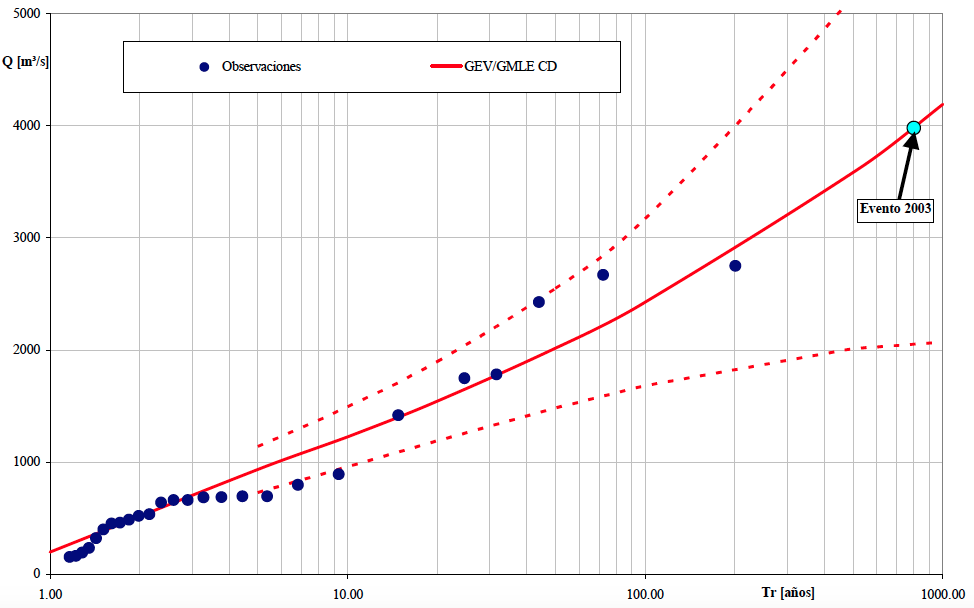

```{r setup, include=FALSE}
library(tidyverse)
library(dplyr)
library(XML)
library(lubridate)
```

## Objetivos da atividade

O objetivo desta atividade é realizar uma análise de frequência de
cheias a nível local. Isso significa que iremos relacionar a magnitude
das vazões máximas anuais com a probabilidade da mesma ser excedida. A
análise a nível local siginifca que utilizaremos apenas as informações
de vazão observadas na estação fluviométrica de interesse, sem fazer uso
de informações sobre as vazões máximas anuais que teham acontecido em
outras estações fluviométricas localizadas na região.

Além de construirmos a relação entre a magnitude das vazões máximas
anuais e a respectiva probabilidade de excedência, é importante saber
estimar também o grau de incerteza nessas estimativas. Essas incertezas
são usualmente representadas por intervalos de confiança, como veremos
mais adianate.

Além de calcular essas quantidades, a curva de frequência, e suas
respectivas incertezas, são representadas graficamente, como na figura
abaixo, que mostra os resultados para um estudo de cheias numa seção do
Rio Salado, localizada na província de Santa Fé, na Argentina, onde em
2003 ocorreu o rompimento de um dique que resultou em perde de vidas
humanas e elevados prejuízos. Nesse caso, utilizou-se a distribuição
Generalizada de Valores Extremos (GEV), mas aqui no curso faremos uso de
uma distribuição mais simples de se trabalhar, a lognormal. O objetivo
aqui é ter uma motivação hidrológica para apreder a usar a linguagem R.

Contruiremos aqui no curso uma figura semelhante a esta, onde no eixo-x
temos o tempo de recorrência e no eixo-y a magnitude das vazões máximas
anuais. O tempo de recorrência apresentado no eixo-x é uma maneira de
representar a probabilidade de excedência. A linha cheia em vermelho
representa o valor esperado dos valores da vazão máxima anual em função
do tempo de recorrência, enquanto as linhas tracejadas representam os
intervalos de confiança de 95%, ilustrando as incertezas envolvidas
nessas estimativas. Os círculos azuis escuros representam as vazões
máximas anuais registradas no passado, enquanto o círculo azul claro
mostra a cheia destruidora de 2003.

```{r curva_freq,echo=FALSE, fig.align = 'center', out.width = "90%", fig.cap = "Curva de frequência do cheias do Rio Salado, na Argentina."}

```

## Seleção das vazões máximas anuais

O primeiro passo de nossa atividade consiste em obter a série de máximos
anuais que desejamos analisar. A obtenção da série de máximos anuais
será realizada em duas etapas. Primeiro vamos obter a séries de vazões
diárias, e para isso utilizaremos a mesma função de obtenção de séries
diárias de vazão que aprendemos na segunda aula deste curso. Com a série
de vazões diárias em mãos, passaremos para a segunda etapa, que é a de
extrair a vazão máxima de cada ano hidrológico.

### Obtenção da série de vazões diárias

A função abaixo permite obter a série de vazões diárias de uma estação
fluviométrica. O único argumento desta função é o código da estação.
Quando chamamos esta função, ela retorna um dataframe com 3 colunas: o
código da estação, a data, e o valor da vazão diária.

Como já estudamos esta função anteriormente, a uitlizaremos aqui sem
entrar em qualqer detalhes sobre seu funcionamento.

```{r dados_hidro_ANA_2}
# Função para obter série histórica de vazão de uma determinada estação ####
dados_serie_ANA <- function(cod_estacao = NA,
                            data_inicio = "01/01/1800",
                            data_fim = Sys.Date(),
                            tipo_dados = 3,
                            nivel_consist = 1){
  
  # Pegar dados a partir do url e transformar em um dataframe
  url_base <-
    paste0("http://telemetriaws1.ana.gov.br/ServiceANA.asmx/",
           "HidroSerieHistorica?",
           "codEstacao=", cod_estacao,
           "&dataInicio=", data_inicio,
           "&dataFim=", data_fim,
           "&tipoDados=", tipo_dados,
           "&nivelConsistencia=", nivel_consist)
  
  url_parse <- XML::xmlParse(url_base, encoding = "UTF-8")
  node_doc <- XML::getNodeSet(url_parse, "//SerieHistorica")
  dados_estacao <- XML::xmlToDataFrame(nodes = node_doc)
  
  # Por algum motivo o hidroweb não está filtrando os dados pela consistencia
  dados_estacao <- filter(dados_estacao, NivelConsistencia == nivel_consist)
  
  # Separar data e hora
  dados_estacao$Data <- as.Date(substr(dados_estacao$DataHora, 1, 10))
  dados_estacao$Hora <- substr(dados_estacao$DataHora, 12, 19)
  
  # Fazer um dataframe só com datas e valores de vazão
  datas_dia <- seq.Date(from = min(dados_estacao$Data),
                        to = max(dados_estacao$Data) %m+% months(1) - 1,
                        by = "day")
  
  tabela_final <- data.frame(Cod_estacao = dados_estacao$EstacaoCodigo[1],
                             Data = as.character(datas_dia),
                             Vazao = as.numeric(NA))
  
  
  for(i in 1:nrow(tabela_final)){
    # Dia em análise
    dia <- as.numeric(substr(tabela_final$Data[i], 9, 10))
    
    # Mês e ano em análise
    mes_ano <- as.Date(paste0(substr(tabela_final$Data[i], 1, 8), "01"))
    
    # Olhar a linha do mes e ano e escolher a coluna pelo dia + 15
    linha_dado <- which(dados_estacao$Data == mes_ano)
    
    # Se não tiver o mês nos dados da estação, colocar valor NA
    ifelse(length(linha_dado) == 0,
           tabela_final$Vazao[i] <- NA,
           tabela_final$Vazao[i] <-
             as.numeric(dados_estacao[linha_dado, (dia + 15)]))
    
  }
  
  return(tabela_final)
}
```

Precisamos escolher uma estação fluviométrica para realizar nossa
análise. Sugiro utilizar a estação **60435000**, localizada na bacia do
Rio Descoberto, que drena uma área de 113.2 km$^2$, mas vocês têm a
indepedência de escolhar qualquer outras estação que esteja no banco de
dados da Agência Nacional de Águas.

Para obter a série diária da estação escolhida, basta chamar a função
acima passando o argumento necessário, que é simplesmente o código da
estação desejada. A função devolve um dataframe com a série de vazões
médias diárias.

Para fins de visualização, utilizamos a função `head(nome_do_dataframe)`
do R, como mostrado abaixo, que nos mostra as primeiras 6 linhas do
dataframe.

```{r dados_FAL_2}
# dados_60435000 <- dados_serie_ANA(cod_estacao = 60435000)
dados_60435000 <- read.table(file = "dados/60435000.txt",
                             sep = "\t",
                             dec = ".",
                             header = TRUE,
                             fileEncoding = "UTF-8")
index_falha_diario <- which(is.na(dados_60435000[, 3] == TRUE))
dias_falha <- dados_60435000[index_falha_diario, 2:3]
head(dados_60435000)
```

Além disso, é sempre importante visualizar os dados para que se teha uma
ideia geral da faixa de variação das vazões, sazonalidade e outras
padrões que possa ser percebidos num gráfico.

Aqui, nós plotaremos a série completa das vazões diárias da estação
**60435000** utilizando o código abaixo, que emprega o chamado R-base,
ao invés de pacote `ggplot2`, visto na aula anterior. Mas se preferir
utilizar o `ggplot2` para realizar esta plotagem, fique à vontade.

```{r, fig.width = 8, fig.height = 6}
time <- as.Date(dados_60435000$Data)
plot(time,dados_60435000$Vazao,type = "l",
     main = "Vazões diárias - estação 60435000",
     xlab = "Anos",ylab = "Q (m³/s)")

# Adiciona grid horizontal apenas
grid(nx = NA, ny = NULL,
     lty = 2,      # Grid line type
     col = "gray", # Grid line color
     lwd = 2)      # Grid line width
```

### Extração da série de vazões máximas anuais

Com a série de vazões diárias, passamos ao segundo passo que é o de
construir a série de máximos anuais com base no ano hidrológico. Para
isso, utilizaremos uma outra função, que é apresentada abaixo. Veja que
a função tem como *default* o ano hidrológico com início no mês de
agosto. Mas o mês de início do ano hidrológico pode ser facilmente
alterado, bastando aicionar esse argumento quando chamar a função.

```{r}
# Contrução da série de máximos anuais a partir de um ano hidrológico ####
fun_max_ano <- function(tabela = NA,
                        comeco_ano_hidro = 8){
  
  # Transformar a coluna Data em "Dates" (caso esteja em character)
  tabela$Data <- as.Date(tabela$Data)
  
  # Definir se o mês em questão entra no ano atual ou no próximo ano
  desloc_ano <- ifelse(month(tabela$Data) < comeco_ano_hidro, 0, 1)
  
  # Ano Hidro
  tabela$ano_hidro <- year(tabela$Data) + desloc_ano
  
  # Fazer uma tabela final apenas com os máximos anuais
  max_anuais <-
    tabela %>%
    group_by(Cod_estacao, ano_hidro) %>%
    summarise(maxima = max(Vazao))
}

```

Para finalmente obtermos a série de máximos anuais, basta chamar a
função fornecendo o arquivo que contém as séries diárias de vazão, que
no nosso caso é o `dados_60435000`. Mais uma vez, podemos utilizar a
função `head` para dar uma leve espiada nas informoações contidas no
dataframe.

```{r , message=FALSE}
Q_max <- fun_max_ano(dados_60435000)
head(Q_max)
```

A função `fun_max_ano` foi escrita de forma que qualquer falha na série
de vazões diárias num dado ano hidrológico resulta numa falha na série
de máximos anuais. Isso nem semrpe é necessário, já que falhas no
período de estiagem não indicam falhas nas séries de máximos, mas creio
que a função nos serve bem para este curso.

Podemos notar a presença de um `NA` na nossa plotagem acima. É
interessante verificar o número total de anos disponíveis com dados
diários de vazão, bem como o número de anos com falha na série de
máximos anuais.

O número de anos com dados de vazões diárias pode ser obtidos
simplemente identificando o número de linhas no dataframe `Q_max`, e
para isso utilizamos o código abaixo,

```{r}
n_anos <- nrow(Q_max)
n_anos
```

Mas já sabemos que o ano de 1978 não contém o valor de vazão máxima
porque a série de vazões diárias não estava completa. Será que há outros
anos no histórico com esse problema? Para identificar se há falha em
outros anos, utilizaremos duas funções do **R** de forma conjunta,
`is.na` e `which`. A função `is.na` identifica se o elemento é um `NA`
ou não, retornando um valor lógico, `TRUE` ou `FALSE`, enquanto a função
`which` permite identificar a posição de uma dada condição. O código
abaixo permite identificar em quais anos ocorrem falhas na série de
máximos anuais,

```{r}
index <- which(is.na(Q_max[,3]==TRUE))
anos_falha <- Q_max[index,2:3]
anos_falha
```

A primeira linha de código identifica as posições em que há a presença
de `NA` na terceira coluna do dataframe, que é a coluna com as
informações sobre as vazões máximas de cada ano hidrológico, e associa à
variável `index`. Na linha seguinte, criamos um novo dataframe com a
informação dos anos em que temos falhas nos dados.

É verdade que poderíamos ter escrito o código acima de uma forma mais
compacta, porém ficaria mais difícil de entender. Veja o que você acha.

```{r}
anos_falha <- Q_max[which(is.na(Q_max[,3]==TRUE)),2:3]
anos_falha
```

Mais à frente, quando tivermos que fazer os cálculos necessários para
realizar a análise de frequência, teremos que nos livrar desses anos com
falhas. Mas por enquanto, vamos deixá-los como estão, e passemos \`a
etapa seguinte que é a de visualizar a série de máximos anuais.

### Visualização da série de máximos anuais

Agora já podemos visualizar a série de máximos anuais que serivirão de
base para a nossa análise de frequência. Essa visualização pode ser
feita com o código abaixo, que utiliza apenas o `R-base`. Mais uma vex,
se desejar utilizar o `ggplot2` para essa plotagem, fique à vontade.

```{r, fig.width = 8, fig.height = 6}
plot(Q_max$ano_hidro,Q_max$maxima,type = "o",
     main = "Máximos anuais - 60435000",
     xlab = "Anos",ylab = "Q_max (m3/s)",lwd = 2)
# Adiciona grid
grid(nx = NULL, ny = NULL,
     lty = 2,      # Grid line type
     col = "gray", # Grid line color
     lwd = 1)      # Grid line width
```

## Construção da curva de frequência amostral

### Posição de plotagem

Para que possamos plotar os círculos azuis escuros da Figura apresentada
anteriormente, para o caso do Rio Salado, que representam as vazões
máximas anuais observadas na série histórica, precisamos determinar as
chamadas posição de plotagem, que servirão de base para o cálculo do
tempo de recorrência empírico para cada valor de vazão da amostra.

Para que seja possível entender esta etapa, vale a pena investir um
certo tempo do curso em alguns conceitos básicos.

O tempo de recorrência associado a uma determinada magnitude de vazão,
$T_r(q)$, é um conceito hidrológico bastante conhecido, de forma que não
dedicaremos muito tempo para discutí-lo aqui. Por definição, o tempo de
recorrência de um evento, cuja magnitude vale $q$, é igual ao inverso da
probabilidade da vazão máxima anual exceder esse valor,

$$T_r(q) = \frac{1}{P(Q>q)}$$

Por exemplo, se a probabilidade da vazão máxima anual ultrapassar um
dado valor $q$ for igual a 0.10, dizemos que o tempo de recorrência
dessa vazão $q$ é de 10 anos. Da mesma forma, se $P(Q>q)=0.01$, dizemos
que o tempo de recorrência de $q$ vale 100 anos.

Portanto, para que possamos incluir as vazões observadas na nossa curva
de frequência, será preciso determinar a probabilidade de excedência de
cada uma das observações contidas na série de vazões máximas anuais da
localidade de interesse. Como o intuito neste primeiro momento é plotar
as vazões observadas na curva de frequência, nos basearemos na chamada
distribuição empírica de frequência.

A distribuição empírica de frequência relaciona cada valor de vazão
máxima observada na série histórica, denominada aqui de $q_i$, com sua
frequência relativa acumulada, $\hat{F}_Q(q_i)$. A quantidade
$\hat{F}_Q(q_i)$ representa a nossa estimativa para a probabilidade da
variável de interesse, $Q$, ser menor ou igual ao valor amostral, $q_i$,

$$\hat{F}_Q(q_i) = \hat{P}(Q \le q_i)$$

em que $\hat{F}_Q$ é a estimativa da frequência relativa acumulada da
variável aleatória $Q$ baseada na amostra, enquanto $q_i$ representa o
valor de uma dada observação $i$. O uso do acento circunflexo na equação
acima é uma convenção utilizada em estatística para mostrar que estamos
nos referindo a uma estimativa da grandeza em questão baseada na amostra
que se tem em mãos.

Já dissemos acima que o tempo de recorrência $T_r(q)$ é função da
probabilidade de excedência, que por sua vez pode ser interpretada como
o complemento de $F_Q(q_i)$. Dessa forma, podemos dizer que

$$\hat{P}(Q \gt q_i) = 1 - \hat{P}(Q \le q_i)$$ de forma que

$$\hat{T}_r(q_i) = \frac{1}{1-\hat{P}(Q \le q_i)}$$

Pode parecer estranho se você estiver vendo isso pela primeira vez, mas
a verdade é que há diferentes maneiras de se estimar a distribuição
empírica de frequência das observações de uma amostra,
$\hat{P}(Q\le q_i)$, ou seu complemento, $\hat{P}(Q\gt q_i)$.

Uma maneira bem comum de estimar tais probabilidades, quando se tem uma
amostra de tamanho $n$, consiste em ordenar a série em ordem decrescente
e determinar a probabilidade de excedência utilizando a seguinte
fórmula,

$$\hat{P}(Q > q_{(i)}) = 1 - \hat{F}_Q(q_{(i)}) = \frac{i}{n+1}$$

em que $q_{(i)}$ representa a chamada estatística de ordem $i$, em que
$q_{(1)}\gt q_{(2)}\gt \ldots \gt q_{(n)}$ representa a série ordenada
das vazões máximas anuais, de forma que $q_{(1)}$ e $q_{(n)}$ são,
respectivamente, a maior e a menor observações da amostra. De acordo com
essa expressão, por exemplo, numa amostra de tamanho 49, a probabilidade
da vazão máxima anual ser maior do que a maior observação da amostra
vale $P(Q>q_{(1)})=0.02$), o que resulta num tempo de recorrência de
$T_r(q_{(1)})=50$ anos.

Não se preocupe tanto se esse conceito de posição de plotagem não ficou
totalmente claro. Basta saber que plotaremos os valores de máximos
anuais da amostra na curva de frequência utilizando a posição de
plotagem de Weibull, que é o nome que se dá à posição de plotagem
$i/(n+1)$.

### Plotagem da amostra na Figura

Na verdade, utilizaremos o tempo de recorrência, $T_r$, para plotagem,
lembrando que o $T_r$ é simplemenste o inverso da probabilidade de
excedência, representada pela posição de plotagem de Weibull.

O código para o cálculo do $Tr$ é apresentado abaixo. Para facilitar a
compreenção de como o cálculo é feito, criaram-se três novas colunas ao
dataframe que contém as vazões máximas anuais. Mas antes disso,
efetuou-se o ordenamento das vazões máximas em ordem decrescente, ou
seja, o primeiro valor de vazão da nova série ordenada é o maior da
amostra.

As três novas colunas são, respectivamente, o índice das vazões,
começando de 1 indo até o número total de valores, a posição de plotagem
de Weilbull, que expressa a probabilidade de excedência, e por último o
tempo de recorrência, $Tr$.

```{r, fig.width = 8, fig.height = 6}
# Remoção dos anos com falha
Q_max <- na.omit(Q_max)
# Ordenamento decrescente do dataframe
Q_max_ord <- Q_max[order(Q_max$maxima, decreasing = TRUE), ]
# Inclusão de Três novas colunas: index, posição de plotagem de Weibull, e Tr
Q_max_ord$index <- seq(from = 1,to = nrow(Q_max_ord))
Q_max_ord$weibull <- Q_max_ord$index/(nrow(Q_max_ord) + 1)
Q_max_ord$Tr <- 1/Q_max_ord$weibull
```

Como já fizemos antes, podemos dar uma espiada nesse novo dataframe com
as vazões máximas anuais ordenada utilizando a função
`head(dataframe_name)`,

```{r}
head(Q_max_ord)
```

A última coluna de `Q_max_ord` contém o valor do tempo de recorrência de
cada uma das observações contidas na amostra. Vale notar que as
observações em `Q_max_ord` estão ordenadas em ordem decrescente.

Podemos agora criar uma Figura, similar àquela apresentada para o estudo
do Rio Salado. Porém, nesta etapa de nossa análise, apenas os valores
amostrais das vazões máximas serão apresentados.

```{r, fig.width = 8, fig.height = 6}

plot(Q_max_ord$Tr,Q_max_ord$maxima,type = "p", pch = 19,cex = 1.5,col = "blue",
     log = "x",main = "Curva de frequência de cheias - 60435000",
     xlab = "Tr (anos)",ylab = "Q_max (m3/s)",
     xlim = c(1, 100),   # X-axis limits
     ylim = c(1, 50))
# Adiciona grid horizontal
axis(1, at = c(seq(1,10,by=1),seq(10,100,by=10),seq(200,1000,by=100)),
     tck = 1, lty = 2, col = "gray")
# Adiciona grid vertical
axis(2, tck = 1, lty = 2, col = "gray")
```

## Ajuste de uma distribuição teórica de probabilidades

Estudos que realizam de análise de frequência de cheias geralmente
utilizam as seguintes distribuições teóricas de probabilidade:

-   Lognormal de 2 parâmetros (LN2)
-   Lognormal de 3 parâmetros (LN3)
-   Generalizada de Valor Extremo (GEV)
-   Log-Pearson Tipo 3 (LP3).

Como o intuito aqui não é o de se aprofundar nos detalhes técnicos de
análise de frequência, o que exigiria um número muito maior de horas de
aula, mas de ter uma motivação maior para aprender a linguagem **R**,
vamos realizar nossa análise de frequência de cheias com a distribuição
GEV utilizando o método da máxima verossimilhança.

### A distribuição GEV

A distribuição Generalizada de Valores Extremos (GEV) surge da Teoria de
Valores Extremos, a qual diz que a distribuição de probabilidades do máximo (ou mínimo) de uma série $Y = \max(X_1, X_2,...,X_m)$,  à medida que $m \rightarrow \infty$, converge para uma das três distribuições de Valores Extremos (EV) possíveis: EVI (distribuição de Gumbel), EVII (Fréchet), ou EVIII (Weibull).

Essas três distribuições foram unificadas em uma única família, a GEV, com três
parâmetros -- posição ($\xi$), escala ($\alpha$) e forma ($\kappa$) -- dada por:

$$
F_Y(y) =
\begin{cases}
  \exp\bigg\{ -\bigg[ 1 - \kappa\bigg( \frac{y - \xi}{\alpha} \bigg) \bigg]^{1/\kappa} \bigg\}, \quad \kappa \neq 0 \\
  \exp\bigg[-\exp\bigg( \frac{y - \xi}{\alpha} \bigg)  \bigg], \quad \quad \quad \quad \ \kappa = 0
\end{cases}
$$

O parâmetro de forma determina qual das distribuições se ajustará aos
dados. Quando $\kappa = 0$, temos a distribuição de Gumbel, também
chamada dupla exponencial. As outras duas formas são assumidas quando
$\kappa \neq 0$. $\kappa < 0$, resulta na distribuição de Fréchet, com
cauda pesada à direita e domínio em $y > \xi + \alpha/\kappa$; enquanto
que $\kappa > 0$ resulta na distribuição de Weibull, com domínio em
$y < \xi + \alpha/\kappa$.

### Quantis da GEV

Uma vantagem interessante de se trabalhar com a GEV é a possibilidade de
estimar seus quantis ($y_p$) de forma analítica. Considerando uma série
de máximos $Y$ e que $F_Y$ é igual à probabilidade de não excedência --
ou seja $p = P(Y \leq y_p) = F_Y(y_p)$. Com $T$ representando o tempo de
retorno, igual ao inverso da probabilidade de excedência, a expressão do
quantil $y_p$ da GEV será:

$$
y_p =
\begin{cases}
  \xi + \frac{\alpha}{\kappa}\big[ -(-\ln p)^\kappa \big], \quad \kappa \neq 0 \\
  \xi - \alpha \ln(-\ln p), \quad \quad \quad \! \! \kappa = 0,
\end{cases}
$$
sendo $p = 1 - 1/T$. 

Logo, a partir de um conjunto de parâmetros estimados ($\hat \xi, \hat \alpha, \hat \kappa$), a estimação do quantil para um tempo de retorno específico se torna simples,

$$
\hat y_p =
\begin{cases}
  \hat \xi + \frac{\hat \alpha}{\hat \kappa}\big[ -(-\ln p)^\hat \kappa \big], \quad \kappa \neq 0 \\
  \hat \xi - \hat \alpha \ln(-\ln p), \quad \quad \quad \! \! \kappa = 0,
\end{cases}
$$

.

No R, podemos criar uma função como a abaixo para calcular os quantis,
que toma como argumentos um valor (ou vetor) de probabilidade de não
excedência e um vetor com as estimativas dos parâmetros da GEV:

```{r quantile_function}
# Quantis para parâmetro de forma diferente de zero
fun.q.gev <- function(p,      # probabilidade de não excedência
                      param   # vetor c/ parâmetros c(xi, alpha, kappa)
                      ){
  
  # Extrair os valores do vetor 'param'
  xi <- param[[1]]; alpha <- param[[2]]; kappa <- param[[3]]
  
  # Quantil
  yp <- xi + alpha/kappa*(1 - (-log(p))^kappa)
  
  return(yp) # quantil explícito em função dos parâmetros
  # e da probabilidade de não excedência
  
}

# Quantis para parâmetro de forma igual a zero
fun.q.gu <- function(p,     # probabilidade de não excedência
                     param  # vetor c/ parâmetros c(csi, alpha)
                     ){                 
  
  # Extrair os valores do vetor 'param'
  xi <- param[[1]]; alpha <- param[[2]]
  
  # Quantil
  yp <- xi - alpha*log(-log(p))
  
  return(yp) # quantil explícito em função dos parâmetros
  # e da probabilidade de não excedência
  
}
```

As funções `fun.q.gev()` e `fun.q.gu()` englobam os dois casos da
família GEV, a depender do valor de $\kappa$, determinando o valor do
quantil `yp` para uma probabilidade de não excedência `p` e um conjunto
de estimativas armazenadas no vetor `param`. Supondo um conjunto
arbitrário de estimativas `param <- c(100, 20, -0.1)` com as quais
queremos calcular o quantil para 50 anos de tempo de retorno
`p <- 1 - 1/50`:

```{r}
param0 <- c(20, 10, -0.1)
p <- 1 - 1/50
q.gev <- fun.q.gev(p = p, param = param0); q.gev
q.gu <- fun.q.gu(p = p, param = param0); q.gu
```

### Métodos de ajuste

Mas, para que esses quantis sejam estimados, que é o que realmente
queremos, precisamos antes ter em mãos um conjunto de estimativas dos
parâmetros da distribuição. Isso requer a seleção de um método de estimação adequado. Alguns métdos  são normalemente empregados para obter essas estimativas: o método dos momentos-L (L-MOM), o método da máxima verossimilhança, ou sua versão alternativa, denominada de máxima verosimilhança generalizada, 
e métodos Bayesianos. Para este curso, trataremos aqui somente do método da máxima verssimilhança.

O método da máxima verossimilhança se baseia, como o próprio nome diz,  na **função de verossimilhança**. A função de verossimilhança representa a distribuição conjunta de se observar a amostra que se tem em mãos. 

Imagine que tenhamos a seguinte amostra em mãos, $\{y_1, y_2, \ldots,y_n\}$, em que as variáveis $Y_i$ sejam independentes e possuam a mesma distribuição de probabildades, representada por sua função densidade $f_Y(y|\theta)$, cujos parâmetros estão dentro do vetor $\theta$.

Como as variáveis que fazem parte da amostra possuem a mesma distribuição e são independentes, a distribuição conjunta que representa a amostra é dada pelo produtório abaixo,

$$
L(y_1, y_2, \ldots,y_n|\theta) = f_Y(y_1|\theta)\times f_Y(y_2|\theta) \times \ldots \times f_Y(y_n|\theta) = \prod_{i=1}^n f_Y(y_i|\theta) 
$$
Vale notar que as observações da amostra $\{y_1, y_2, \ldots,y_n\}$ são fixas, de modo que o valor da função verossimilhança depende da distribuição de probabilidades $f_Y(y|\theta)$ e dos valores de seus respectivos parâmetros $\theta$. 

Se as variáveis $Y_i$ forem discretas, $L(y_1, y_2, \ldots,y_n|\theta)$ representa a probabilidade de se observar a amostra que foi realmente observada, desde que ela realmente tenha sido gerada a partir da distribuição $f_Y(y_i|\theta)$. Quando essas variáveis são contínuas, que é caso das séries de vazões máximas anuais, o valor da função verossimilhança é apenas proporcional à probabilidade de se observar amostra. Mas essa proporcionalidade, ao invés da igualdade, não impede a conclusão de que um dado conjunto de parêmteros $\theta_1$ pode resultar numa probabilidade maior de observar a amostra que se tem em mãos do que um outro conjunto de parâmetros $\theta_2$, e é exatamente esse fato que que justifica a lógica do método.  

A lógica do método está em identificar o conjunto de parâmetros de uma dada distribuição previamente selecioanada que maximize a probabilidade de se observar amostra que foi de fato observada. Assume-se que a amostra observada é bastante provável, e foi exatamente por isso que ela foi observada.

Com essa ideia em mente, fica fácil compreender o porquê que o método da máxima verossimilhança busca encontrar o conjunto de parâmetros da distribuição selecionada que maximiza a função verossimilhança,

$$
\hat \theta = \underset{\theta \in \Theta}{arg} \; max\; L(y_1,y_2,\ldots,y_n|\theta)
$$
pois deseja-se selecionar os valores de $\theta$ que tornem a amostra a mais provável possível.

considerarmos que estamos partindo de um conjunto
$Y = (y_1, y_2,..., y_n)$ de observações independentes e igualmente
distribuídas, a função de verossimilhança, sendo $Y$ uma variável
aleatória contínua, será proporcional à função densidade conjunta das
observações $f_Y(y_1,y_2,...,y_n|\theta)$ -- sendo $\theta$ um conjunto
de 1 ou mais parâmetros da distribuição $f_Y$. A hipótese de
independência faz com que possamos considerar que essa densidade
conjunta seja simplesmente o produtório da função densidade avaliada em
cada uma das observações de $Y$, ou seja
$f_Y(y_1,y_2,...,y_n|\theta) = f_Y(y_1|\theta) \cdot f_Y(y_2|\theta) \cdot ... \cdot f_Y(y_n|\theta)$,
que pode ser interpretado como a probabilidade de se ter observado
determinada amostra. Partindo disso, podemos definir a função de
verossimilhança como:

$$
L(y|\theta) = \prod_{i=1}^n f_Y(y_i|\theta).
$$

Assim, como o próprio nome diz, o método da máxima verossimilhança
consiste em maximizar a função de verossimilhança $L(y|\theta)$, obtendo
o conjunto de parâmetros $\hat \theta$ que resulta nesse máximo. Esse
processo de otimização é, em muitos casos, baseado em algum algoritmo de
gradiente (como Newton-Raphson) e uma transformação que facilita a
convergência desses algoritmos é tirar o logaritmo da função -- sendo
log uma função monotônica, essa transformação afeta somente o valor do
máximo, mas não o valor de $\hat \theta$. Então, para a GEV, podemos
definir a log-verossimilhança como:

$$
\ln[L(y|\xi, \alpha, \kappa)] = - n\ln(\alpha) + \sum_{i=1}^n\bigg[ \bigg(\frac{1}{\kappa} - 1\bigg) \cdot\ln(z_i) - z_i^{1/\kappa} \bigg],
$$em que $z_i = 1 - \kappa/\alpha \cdot (y_i - \xi)$.

### Ajuste da GEV e estimativa dos quantis

Agora com a teoria fora do caminho, vamos para a prática. Resumindo o
processo acima devemos ter em mãos:

1.  Nossa série de vazões máximas anuais, as quais já estão armazeneadas
    no nosso data frame `Q_max`;
2.  Nossas estimativas de $\hat \xi$, $\hat \alpha$ e $\hat \kappa$
    obtidas utilizando o método da máxima verossimilhança;
3.  Nossas estimativas de quantis de cheia $\hat Q_p$, que serão obtidas
    com a expressão de $y_p$ apresentada anteriormente.

Vamos dividir nossa função de estimação dos parâmetros em duas. A
primeira função será a nossa função de log-verossimilhança, encarregada
simplesmente de retornar o valor de $\ln[L(y|\xi, \alpha, \kappa)]$ para
um conjunto de parâmetros e uma série de máximos anuais, enquanto a
segunda empregará uma função de otimização para maximizar a primeira.

Nossa primeira função será bem completa. Vamos englobar as duas formas
da GEV quando $\kappa \neq 0$ e quando $\kappa = 0$ e, para o primeiro
caso, testaremos os limites teóricos da função, atribuindo um indicador
de erro (geralmente um número muito alto que se destaque quando
analisarmos os resultados) caso alguma observação da série de máximos
anuais esteja fora do domínio. Adicionalmente, também testamos para
parâmetros de escala positivos. Esses critérios ajudam a orientar o
otimizador, estabelecendo limites para os parâmetros possíveis fazendo
com que ele fuja desses limites.

```{r gev_likelihood}

# Estimador de Máxima Verossimilhança - GEV
fun.l.gev <- function(param, # vetor c/ os parâmetros, 1. csi 2. alpha, 3. kappa (ou somente 1 e 2)
                      y       # vetor c/ a série AM observada
                      ){
  
  # Tamanho da série
  n <- length(y)
  
  # Dependendo do tamanho do vetor, escolher a distribuição
  n.par <- length(param)
  
  if(n.par == 3){ # GEV completa
    
    # Extrair parâmetros
    xi <- param[[1]]; alpha <- param[[2]]; kappa <- param[[3]]
    
    # Avaliar kappa e domínio da função
    if(kappa < 0){ # Testar se kappa é negativo (Fréchet)
      
      # Testar limite inferior
      if(min(y) < (xi + alpha/kappa)){
        
        # Marcador de erro
        ln.L <- 1e6
        
      } else{
        
        # Se estiver dentro do domínio, calcular a verossimilhança
        ln.L <- -(- n*log(alpha) + sum((1/kappa - 1)*log(1 - kappa/alpha*(y - xi)) - (1 - kappa/alpha*(y - xi))^(1/kappa)))
        
      }
      
    } else{ # kappa positivo (Weibull)
      
      # Testar limite superior
      if(max(y) > (xi + alpha/kappa)){
        
        ln.L <- 1e6
        
      } else{
        
        ln.L <- -(- n*log(alpha) + sum((1/kappa - 1)*log(1 - kappa/alpha*(y - xi)) - (1 - kappa/alpha*(y - xi))^(1/kappa)))
        
      }
      
    }
    
    # Testar parâmetro de escala (deve ser maior que zero)
    if(alpha < 0) ln.L <- 1e6
  
    return(ln.L)
    
  } else{
    
    # Aqui avaliaremos quando kappa = 0 (ou seja, n.par == 2)
    # Extrair parâmetros
    xi <- param[[1]]; alpha <- param[[2]]
    
    # Como a distribuição de Gumbel não possui limites, precisamos avaliar somente
    # se o parâmetro de escala é positivo
    if(alpha < 0){
      
      ln.L <- 1e6
      
    } else{
      
      ln.L <- -(-n*log(alpha) - sum((y - xi)/alpha + exp(-(y - xi)/alpha)))
      
    }
    
    return(ln.L)
    
  }
    
  
}

```

Algo importante que precisa ser ressaltado é que colocamos o sinal
negativo na frente da função de verossimilhança. Fizemos isso porque
grande parte dos algoritmos de otimização trabalham com a minimização de
uma função, então, no nosso caso, a minimização do negativo de uma
função será sua maximização. É importante lembrar disso, pois adiante
precisaremos inverter o sinal do máximo.

Vamos avaliar a função escrita com os mesmo parâmetros arbitrários que
definimos anteriormente:

```{r}
fun.l.gev(param = param0,
          y = Q_max$maxima)

fun.l.gev(param = param0[-3], # removendo o último elemento do vetor
          y = Q_max$maxima)
```

Para a maximização vamos usar uma função do R base, o `optim()`. Não
chegaremos a aplicar a função `fun.l.gev()` diretamente, mas
indiretamente. A aplicação função `optim()` é simples, exigindo os
seguintes argumentos:

-   `par`: um vetor com parâmetros que devem ser otimizados (nosso vetor
    `param`);

-   `fn`: a função que desejamos otimizar (no nosso caso `fun.l.gev`); e

-   `method`: o método de otimização desejado (por padrão está definodo
    como "Nelder-Mead").

Adicionalmente, também passamos os outros argumentos necessários para a
função que definimos em `fn`. No caso da `fun.l.gev()`, precisaremos
passar `y`. Na Seção **Descrição das incertezas**, discutiremos ainda
como podemos quantificar as incertezas na estimativa do nosso conjunto
de parâmetros e nos quantis. A abordagem utiliza a matriz Hessiana do
processo de otimização (que explicaremos adiante) e, por esse motivo,
vamos passar para o `optim()` o argumento `hessian = TRUE`. Antes de
escrever uma nova função que já nos devolva o dado da forma que
queremos, vamos simplesmente analisar o funcionamento do `optim()`.

```{r teste_optim}
max.l.gev <- optim(par = param0,
                   fn = fun.l.gev,
                   hessian = TRUE,
                   y = Q_max$maxima)

max.l.gev
```

Vemos que a função nos retorna uma lista com um conjunto de objetos que
podem ser acessados de dentro da lista com `$nome_objeto` ou
`[["nome_objeto"]]`. Dentre os principais (aqueles que realmente estamos
interessados) estão `$par`, `$value` e `$hessian`, representando o
conjunto de parâmetros otimizados, o valor do nosso mínimo (que na
verdade é o negativo do máximo) e a matriz hessiana. Mas os demais
também são importantes. Se olharmos a documentação do `optim()`, veremos
que o objeto `$convergence` indica alguns possíveis erros que podem ter
ocorrido durante o processo de otimização. Uma convergência bem sucedida
apresentará `convergence = 0`, mas notamos que o nosso
`max.l.gev$convergence` foi igual a `r max.l.gev$convergence`, ou seja,
o número de iterações não foi suficiente para atingir a convergência.
Por padrão, o número máximo de iterações para `method = "Nelder-Mead"` é
de 500, o que não foi suficiente, mas esse (além de muitos outros
parâmetros) podem ser alterados passando uma lista para o argumento
`control`. Vamos testar então `control = list(maxit = 1000)`.

```{r}
max.l.gev <- optim(par = param0,
                   fn = fun.l.gev,
                   hessian = TRUE,
                   control = list(maxit = 1000),
                   y = Q_max$maxima)

max.l.gev
```

Perfeito! Definindo um `maxit = 1000` já foi suficiente para garantir a
convergência da nossa otimização e agora que temos nosso conjunto final
de $\hat \xi$, $\hat \alpha$ e $\hat \kappa$ podemos estimar nossos
quantis.

```{r quantis}
# Estimar quantis
param <- max.l.gev$par
p <- seq(from = 0.01, to = 0.99, by = 0.01) # quais probabilidades
tr <- 1/(1 - p)                             # tempos de retorno para cada p
qp <- fun.q.gev(p = p, param = param)       # estimar quantis

# Organizar dados em um data.frame
df.quantis <- data.frame(tr = tr,
                         qp = qp)
```

Podemos dar uma espiada no dataframe que contém os quantis de cheia
utilizando a função `head()`,

```{r}
head(df.quantis)
```

Podemos perceber que os seis primeiros valores dos quantis estimados não
são tão interessantes, pois eles estão associados a tempos de
recorrência muito baixos. Existe uma outra função no função no `R` que
permite espiar a parte final do dataframe, ao invés da parte inicial.
Essa função é chamada de `tail()`.

```{r}
tail(df.quantis, 5)
```

O número `5` no código acima serve para especificar quantas linhas eu
estou interessado em ver.

Finalizamos esta parte da análise com a plotagem dos quantis de cheias
estimados com base na distribuição GEV, comparando com as vazões
observadas na série histórica da estação.

```{r, fit.width = 8, fig.height = 6}
# Plotar as vazões observadas
plot(Q_max_ord$Tr, Q_max_ord$maxima, type = "p", pch = 19, cex = 1.5, col = "blue",
     log = "x", main = "Curva de frequência de cheias - 60435000",
     xlab = "Tr [anos]", ylab = "Q [m³/s]",
     xlim = c(1, 100), ylim = c(1, 50))

# Adicionar quantis estimados com a GEV
lines(df.quantis$tr, df.quantis$qp,
      col = "red",
      lwd = 2)

# Adicionar linhas de grade horizontais
axis(1, at = c(seq(1, 10, 1), seq(10, 100 , 10), seq(200, 1000, 100)),
     tck = 1, lty = 2, col = "gray")

# Adicionar linhas de grade verticais
axis(2, tck = 1, lty = 2, col = "gray")

```

## Descrição das incertezas {#descricao-incertezas}

Quando realizamos uma análise de frequência, além da estimativa dos
quantis de cheia, precisamos ter uma ideia do quão confiantes estamos em
relação aos valores estimados. Sendo assim, precisamos entender como
calcular a precisão dessas estimativas.

Normalmente, a maneira que empregamos para descrever as incertezas nas
estimativas dos quantis de cheias é por meio de intervalos de confiança.
Neste nosso exercício aqui, aprenderemos como calcular intervalos de
confiança associados à distribuição GEV, que é a distribuição que está
sendo utilizada por nós para construir a curva de frequência.

Existem diferentes formas de se estimar esses intervalos. Aqui, vamos
focar no Método Delta. Descrições mais detalhadas podem ser encontradas
na literatura, como [Coles,
2001](https://doi.org/10.1007/978-1-4471-3675-0).


### Método Delta

Supondo o logaritmo de uma função de verossimilhança como a que definido como $F_Y$, mas com um único parâmetro $\theta$. Essa função pode ser aproximada por uma curva gaussiana, cujo pico está localizado no estimador de máxima verossimilhança $\hat\theta_0$. A incerteza (ou a precisão) sobre a estimativa desse parâmetro está relacionada ao grau de curvatura da função de verossimilhança. A o grau de curvatura de uma função é descrito pela derivada segunda dessa função. Em outras palavras:

$$
\frac{d^2}{d\theta^2}\ln[L(y|\theta)] \propto \frac{1}{Var[\hat\theta]},
$$
ou seja, quanto maior o grau de curvatuura, menor será a variância da estimativa.

Quando trabalhamos com uma distribuição de $k$-parâmetros, $\ln[L(\theta)]$ pode ser aproximada por uma normal multivariada, cuja curvatura pode ser descrita por uma matriz quadrada $k \times k$ chamada matriz de informação observada (ou matriz hessiana) $\I(\theta). Para o nosso caso, com a GEV, $\theta$ é um vetor com três parâmetros, então nossa matriz será uma matriz $3 \times 3$:

$$
I(\xi, \alpha,\kappa) =
\begin{bmatrix}
  -\frac{d^2}{d\xi^2}\ln(L) & -\frac{d^2}{d\xi\alpha}\ln(L) & -\frac{d^2}{d\xi\kappa}\ln(L) \\
  -\frac{d^2}{d\alpha\xi}\ln(L) & -\frac{d^2}{d\alpha^2}\ln(L) & -\frac{d^2}{d\alpha\kappa}\ln(L) \\
  -\frac{d^2}{d\kappa\xi}\ln(L) & -\frac{d^2}{d\kappa\alpha}\ln(L) & -\frac{d^2}{d\kappa^2}\ln(L) \\
\end{bmatrix}.
$$

### Incerteza nos parâmetros

Seguindo a hipótese da normal multivariada, e chamando $I(\theta)^{-1}$ de $\psi_{i,j}$, podemos afirmar que $\hat\theta_i \sim N(\theta_i, \psi_{i,i})$, de modo que para um intervalo de confiança estimado de $(1 - \alpha)$ para $\theta_i$ – sendo $\alpha$ aqui o nível de significância – será:

$$
\hat\theta_i \pm z_{\frac{\alpha}{2}}\sqrt{\psi_{i,i}},
$$
em que $z_{\frac{\alpha}{2}}$ é o quantil $(1 - \alpha/2)$ da distribuição normal padrão. Ou seja, para estimar os intervalos de confiança dos parâmetros pela matriz hessiana, precisamos somente dos elementos da diagonal principal da nossa matriz `max.l.gev$hessian` invertida.

```{r hessiana}
hess <- max.l.gev$hessian; hess
```

No R, a inversão de matrizes pode ser feita com a função `solve()`. Essa inversa também é chamada de matriz de covariância ($V$).

```{r matriz_covariancia}
cov <- solve(hess)    # inverter a matriz hessiana
cov.diag <- diag(cov) # extrair os elementos da diagonal principal
cov.diag
```

Os elementos da diagonal principal da matriz de covariância `cov.diag` representam a variância estimada de cada um dos parâmetros, portanto, podemos facilmente estimar os limites dos intervalos de confiança para um dado nível de significância.

```{r ic_param}

nivel.signf <- 0.05           # nível de significância
z <- qnorm(1 - nivel.signf/2) # quantil da normal padrão

# Montar data.frame c/ intervalos de confiança
df.ic.param <- data.frame(par = param,
                          var = cov.diag,
                          sd = sqrt(cov.diag),
                          ic.inf = param - z*sqrt(cov.diag),
                          ic.sup = param + z*sqrt(cov.diag))

df.ic.param

```

### Incerteza nos quantis

A estimação da incerteza dos quantis segue da estimativa da incerteza nos parâmetros, mas o peso que cada parâmetro exerce na incerteza final do quantil não é a mesma. O método delta consiste em estimar a variância de um quantil calculado como sendo:

$$
\begin{gather}
  Var[y_p] = \nabla_{y_p}^T \ V  \ \nabla_{y_p}, \\
  \nabla_{y_p} =
  \begin{bmatrix}
    \frac{\partial y_p}{\partial \xi} \\
    \frac{\partial y_p}{\partial \alpha} \\
    \frac{\partial y_p}{\partial \kappa} \\
  \end{bmatrix},
\end{gather}
$$
sendo $\nabla_{y_p}$ uma matriz de pesos, indicando a importancia que cada parâmetro tem na estimativa do quantil e $\nabla_{y_p}^T$ é a transposta desse vetor.

O primeiro passo então seria calcular as derivadas parciais que compõem o vetor $\nabla_{y_p}$. Como temos duas funções possíveis, vamos estruturar uma forma de calculá-las conferindo o comprimendo no nosso vetor de parâmetros partindo do vetor de probabilidades`p` que definimos quando calculamos os quantis. Para ficar mais fácil, podemos juntar essas etapas em uma única função.

```{r ic_quantis}
n.par <- length(param)
n.p <- length(p)
var.q <- rep(NA, n.p)

for(prob in seq_along(p)){
  
  # Estimar um vetor vetor de pesos (grad.q) p/ cada probabilidade
  if(n.par == 3){
    
    xi <- param[[1]]; alpha <- param[[2]]; kappa <- param[[3]]
    d.xi <- 1                                      # dq/dξ
    d.alpha <- 1/kappa*(1 - (-log(p[prob]))^kappa) # dq/dα
    aux <- -log(p[prob])                           # simplificar dq/dκ
    d.kappa <- -alpha/(kappa^2)*(1 - aux^kappa) - alpha/kappa*aux^kappa*log(aux) # dq/dκ
    grad.q <- c(d.xi, d.alpha, d.kappa)            # vetor gradiente (pesos)
    
  } else{
    
    xi <- param[[1]]; alpha <- param[[2]];
    d.xi <- 1                        # dq/dξ
    d.alpha <- -log(-log(p[prob[]])) # dq/dα
    grad.q <- c(d.xi, d.alpha)       # vetor gradiente (pesos)
    
  }
  
  var.q[prob] <- t(grad.q) %*% cov %*% grad.q
  
}

# Com o vetor de variâncias preenchido, podemos calcular os demais
df.quantis <- df.quantis %>% 
  mutate(var = var.q,
         sd = sqrt(var.q),
         ic.inf = qp - z*sqrt(var.q),
         ic.sup = qp + z*sqrt(var.q))


```


### Plotagem final da curva de frequência

Podemos terminar nossa figura da curva de frequência de cheias incluindo os intervalos de confiança estimados de 95%:

```{r}
# Plotar as vazões observadas
plot(Q_max_ord$Tr, Q_max_ord$maxima, type = "p", pch = 19, cex = 1.5, col = "blue",
     log = "x", main = "Curva de frequência de cheias - 60435000",
     xlab = "Tr [anos]", ylab = "Q [m³/s]",
     xlim = c(1, 100), ylim = c(1, 50))

# Adicionar quantis estimados com a GEV
lines(df.quantis$tr, df.quantis$qp,
      col = "red",
      lwd = 2)

# Adicionar linhas dos intervalos de confiança
lines(df.quantis$tr, df.quantis$ic.inf,
      col = "black", lty = 2, lwd = 1.2)
lines(df.quantis$tr, df.quantis$ic.sup,
      col = "black", lty = 2, lwd = 1.2)


# Adicionar linhas de grade horizontais
axis(1, at = c(seq(1, 10, 1), seq(10, 100 , 10), seq(200, 1000, 100)), tck = 1, lty = 2, col = "gray")
axis(2, tck = 1, lty = 2, col = "gray")

```

Vemos que apesar de vazões mais extremas terem ficado fora da curva de quantis estimados pela GEV, os valores ainda estão dentro do intervalo de confiança estimado.


## Uma função geral

Vamos listar tudo o que fizemos até agora: estimamos as posições de
plotagem das vazões máximas anuais observadas; ajustamos nossa
distribuição de interesse a essas vazões e obtivemos um conjunto de
estimativas para seus parâmetros; definimos percentis para estimar
nossos quantis; e plotamos uma curva de frequência para comparar a
performance do nosso ajuste. Veja que fizemos isso em etapas
individuais.

Quando trabalhamos somente com uma estação, um procedimento mais manual
como fizemos acima pode ser parecer mais fácil, mas quando nossa região
de estudo aumenta e com ela o número de estações para analisarmos, pode
ser que essa análise como foi feita se torne muito manual e tome mais
tempo. Muitas vezes vale a pena o esforço para estruturar um código
completo que englobe todas as etapas da nossa análise em uma única
função geral. É isso que faremos adiante. *Houve uma alteração nos
dados?* Sem problema, basta rodar uma função. *Nosso conjunto de análise
aumentou?* Tudo bem, a função é genérica e pode ser aplicada para séries
diferentes facilmente.

Vamos começar. Nossa função deve receber como argumentos: **1)** uma vetor com a série de máximos anuais/ **2)** um vetor com parâmetros iniciais para serem otimizados; **3)** um vetor com probabilidades para estimar os quantis.

Lembrando que já criamos algumas funções anteriormente que usaremos aqui novamente. Uma estratégia interessante para evitar que nossa função principal fique muito carregada e confusa é criar um script adicional e colocar nele todas as funções "auxiliares" e depois simplesmente chamá-las usando a função `source()` do R. Criaremos, então, um arquivo chamado "frequency_analysis_aux.R" e colaremos nossas funções `fun.q.gev`, `fun.q.gu` e `fun.l.gev`.

```{r fun.fit.gev}
fun.fit.gev <- function(maximos,                # vetor: série de máximos anuais
                        param,                  # vetor: parâmetros iniciais, length igual a 2 ou 3: 1. posição, 2. escala, 3. forma
                        probs,                  # vetor: probabilidades p/ estimar os quantis
                        aux.fun.path = getwd(), # caminho do diretório onde se encontra o script c/ funções auxiliares
                        aux.fun.name = "frequency_analysis_gev_aux.R", # nome do script c/ funções auxiliares
                        maxit = 1000,           # número máximo de iterações 'optim()'
                        nivel.signf = 0.05      # nível de significância (padrão 5%)
                        ){
  
  # Checar classe dos parâmetros
  if(!inherits(c(maximos, param, probs), "numeric")){
    stop("Parâmetros 'maximos', 'param' e 'probs' devem ser vetores.")
  }
  
  # Checar parâmetros
  n.par <- length(param)
  if(!(n.par %in% c(2,3))){
    stop("Vetor de parâmetros deve ter comprimento:
    -  2 (parâmetro de forma igual a 0, Gumbel) ou;
    -  3 (parâmetro de forma diferente de 0, Frechet e Weibull);
    com parâmetros na ordem: 1. posição, 2. escala e 3. forma.")
  }
  
  # Chamar funções no script "frequency_analysis_aux.R"
  aux.path <- paste(aux.fun.path, aux.fun.name, sep = "/")
  if(!file.exists(aux.path)){
    stop("O arquivo '", aux.fun.name, "' não existe no diretório informado em 'aux.fun.path'.")
  }
  source(aux.path) # chamar o script de funções auxiliares
  
  # Encurtar nome das veriáveis
  y <- maximos
  par <- param
  p <- probs
  
  # Ajustar a GEV
  max.l.gev <- optim(par = par,
                     fn = fun.l.gev,
                     hessian = TRUE,
                     y = y)
  
  if(max.l.gev$convergence != 0){
    message("Houve erros na convergência, checar $convergence.")
  }
  
  # Extrair resultados do ajuste
  par <- max.l.gev$par
  hess <- max.l.gev$hessian
  
  # Estimar quantis
  tr <- 1/(1 - p) # tempos de recorrência
  if(n.par == 3){
    qp <- fun.q.gev(p, par)
  } else{
    qp <- fun.q.gu(p, par)
  }
  
  # Incerteza nos parâmetros
  cov <- solve(hess)            # matriz de covariância
  cov.diag <- diag(cov)         # extrair diagonal principal
  z <- qnorm(1 - nivel.signf/2) # quantil normal padrão
  res.par <- data.frame(par = par,                         # parâmetros
                        var = cov.diag,                    # variância parâmetros
                        sd = sqrt(cov.diag),               # desvio padrão parâmetros
                        ic.inf = param - z*sqrt(cov.diag), # limite inferior IC
                        ic.sup = param + z*sqrt(cov.diag)) # limite superior IC
  
  # Incerteza nos quantis
  n.p <- length(p)      # número de quantis calculados
  var.q <- rep(NA, n.p) # vetor vazio p/ armazenar variâncias
  
  for(prob in seq_along(p)){
  
  # Estimar um vetor vetor de pesos (grad.q) p/ cada probabilidade
  if(n.par == 3){
    
      xi <- param[[1]]; alpha <- param[[2]]; kappa <- param[[3]] # extrair parâmetros
      d.xi <- 1                                                  # dq/dξ
      d.alpha <- 1/kappa*(1 - (-log(p[prob]))^kappa)             # dq/dα
      aux <- -log(p[prob])                                       # simplificart dq/dκ
      d.kappa <- -alpha/(kappa^2)*(1 - aux^kappa) - alpha/kappa*aux^kappa*log(aux) # dq/dκ
      grad.q <- c(d.xi, d.alpha, d.kappa)                        # vetor gradiente (pesos)
      
    } else{
      
      xi <- param[[1]]; alpha <- param[[2]]; # extrair parâmetros
      d.xi <- 1                              # dq/dξ
      d.alpha <- -log(-log(p[prob]))         # dq/dα
      grad.q <- c(d.xi, d.alpha)             # vetor gradiente (pesos)
      
    }
    
    var.q[prob] <- t(grad.q) %*% cov %*% grad.q
  
  }
  
  res.quantis <- data.frame(tr = tr,
                            qp = qp,
                            var = var.q,
                            sd = sqrt(var.q),
                            ic.inf = qp - z*sqrt(var.q),
                            ic.sup = qp + z*sqrt(var.q))
  
  
  # Organizar resultados
  return(list("parametros" = par,
              "res.par" = res.par,
              "res.quantis" = res.quantis))
  
}

teste <- fun.fit.gev(maximos = Q_max$maxima,
                     param = c(20, 10, -0.2),
                     probs = seq(0.01, 0.99, 0.01),
                     aux.fun.path = getwd(),
                     aux.fun.name = "frequency_analysis_gev_aux.R",
                     maxit = 1000,
                     nivel.signf = 0.05)
 

```