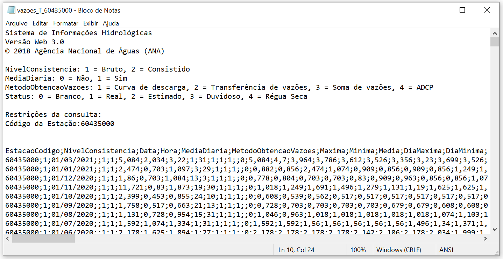
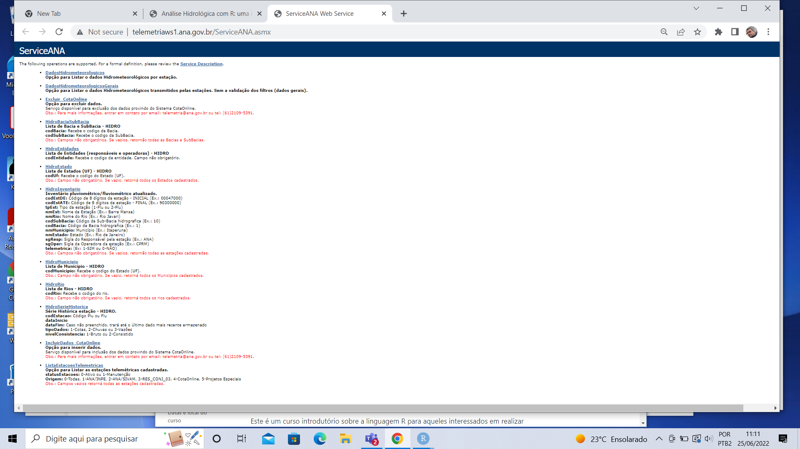

```{r setup, include=FALSE}
library(knitr)
library(XML)
library(dplyr)
```

## Repositório de dados

Existem inúmeros repositórios contendo dados hidrológicos no mundo e no Brasil. Alguns exemplos são:
- HidroWeb da ANA;
- Séries históricas do ONS;
- Dados do CPRM;
- Dados do INMET.

## Obtenção de dados "tradicional"

Uma maneira de obter dados é simplesmente baixando eles de algum site oficial. Geralmente o arquivo baixado está no formato `.csv`, `.txt` ou `.xls` (excel) - esse último sendo menos comum. No próprio portal da ANA tem a opção de baixar os dados diretamente se souber a estação em questão ou utilizando um mapa dinâmico. Fazemos o exemplo abaixo para a estação 60435000. Ao baixar o arquivo, é importante entender como ele está salvo, para isso podemos abrir o arquivo pelo bloco de notas por exemplo. O arquivo em questão é mostrado na figura abaixo

```{r obtencao_dados_trad_imagem_1, echo = FALSE, layout = "l-body-outset", fig.align = 'center', out.width = "100%", fig.cap = ""}

```

É possível perceber alguns detalhes importantes. As primeiras 13 linhas contém informações sobre o sistema em sí e a estação, mas os dados medidos começam de fato na linha 14. O separador de cada coluna é um `;` e os decimais são separados por `,`. Agora já temos as informações necessárias para acessar esses dados pelo **R**. Usamos aqui a função `read.table()`, também é possível utilizar a função `read.csv()`, ambas fazem a mesma coisa, apenas alteram os argumentos pré definidos (que podem ser trocados).

```{r obtencao_dados_trad_1}
dados_ANA <- read.table(file = "dados/vazoes_T_60435000.txt",
                        skip = 13,
                        header = T,
                        sep = ";",
                        dec = ",")
```

Agora podemos ver quais colunas existem nesse dataframe dentro do próprio **R** e tentar entender ele melhor também!

```{r obtencao_dados_trad_2}
colnames(dados_ANA)
```

A seguir puxaremos o mesmo dado porém diretamente da internet, utilizando o que chamamos de *webservice*. Isso facilita muito a criação de códigos mais automatizados em que não é necessário ficar baixando os dados um a um.

## Obtenção via webservice
Ser capaz de obter informações hidrológicas de forma gratuita diretamente da internet, algo conhecido como "webscraping", representa um ganho significativo de eficiência no desenvolvimento de estudos e projetos de hidrologia, recursos hídricos, e áreas afins.

Essa possibilidade vem se tornando cada vez mais comum nos dias de hoje. Por exemplo, a Agência Nacional de Águas e Saneamento Básico (ANA), o Operador Nacional do Sistema Elétrico (ONS), e outras instituições no Brasil e no exterior disponibilizam alguns de seus dados por meio do chamado webservice. 

Em essência, o webservice é apenas um site que contém os dados. Porém, esses dados estão organizados de uma maneira bem específica, de forma que para que seja possível obtê-los de forma eficiente, é imprescindível que essa organização seja bem entedida. Aqui neste curso introdutório, vamos focar nossas atividades no webservice da ANA, que se encontra disponível por meio do  url <http://telemetriaws1.ana.gov.br/ServiceANA.asmx>.

Quando acessamos esse endereço, somos levados para a página abaixo,

```{r webservice_ANA, echo = FALSE, layout = "l-body-outset", fig.align = 'center', out.width = "100%", fig.cap = ""}

```

Se dermos um zoom na figura, podemos verificar todas as informações que estão disponíveis no webservice, tais como "dados hidrometeorológicos", "dados hidrometeorológicos gerais", "lista de estações telemétricas", "Cotas", "inventário", "rios", "série histórica", entre outras. 

Nesse mesmo site, pode-se acessar um arquivo em formato pdf com detalhes sobre o sistema como um todo, e com o que se pode obter dentro dele <http://telemetriaws1.ana.gov.br/Telemetria1ws.pdf>! Esse arquivo é essencial para entendermos como os dados estão disponíveis e como podemos acessá-los.

Esse documento nos informa que os dados hidrológicos da ANA estão disponibilizados no formato XML ("Extended Markup Language"), de forma que precisamos aprender como acessar e manipular as informações disponibilizados nesse formato. Mas discutiremos apenas o básico neste curso, sem nos profundarmos muito. Porém se você deseja saber mais sobre webscraping e usufruir de várias de suas possibilidade, sugerimos que procure se aprofundar mais nesse tema.

## Lista das Estações Telemétricas da ANA

Começaremos nossas atividades acessando os dados das estações telemétricas desse sistema. Pode-se perceber olhando para o próprio site, que são necessários dois parâmetros para pesquisar as estações. O primiero chama-se “statusEstacoes”, que pode ser 0, que significa estação ativa, ou 1, que representa estação em manutenção. O segundo parâmetro é chamado de “Origem”, podendo variar entre 0 e 5. Se olharmos o arquivo em formato pdf mencioando acima, vamos ver que se deixarmos o “statusEstacoes” em branco, serão retornadas as informações de todas as estações do sistema, que é exatamente o que queremos agora. 

Sendo assim, se colocarmos no nosso navegador o seguinte url: <http://telemetriaws1.ana.gov.br/ServiceANA.asmx/ListaEstacoesTelemetricas?statusEstacoes=&origem=>, teremos acesso ao arquivo XML com a informação de todas as estações telemétricas.

```{r XML_ANA_info_1, echo = FALSE, fig.align = 'center', out.width = "90%", fig.cap = ""}
knitr::include_graphics("images/XML_ANA_info_1.png")
```

Para que tenhamos cesso a essas informações nesse mesmo formato no RStudio, teremos que fazer uso de um pacote chamado "XML", que contém a função denominada xmlParse(). Essa função é capaz de ler um arquivo do tipo XML e gerar uma estrutura no R similar ao que aparece na imagem acima (formato de “árvore”). A função exige que informemos um argumento obrigatório, que é o url a ser utilizado, e permite ainda que passemos um argumento opcional, que é a codificação do arquivo (do inglês encoding). Usualmente no Brasil, utilizamos o “UTF-8” para poder utilizar nossos acentos (mas lembre-se que essa parte é um outro mundo no R e não entraremos com maiores detalhamentos).

```{r XML_no_R_ANA}
status_codigo <- ""
origem_codigo <- ""

url_base <- paste0("http://telemetriaws1.ana.gov.br/ServiceANA.asmx/ListaEstacoesTelemetricas?",
                   "statusEstacoes=", status_codigo, "&origem=", origem_codigo)
url_parse <- XML::xmlParse(url_base, encoding = "UTF-8")
```

Olha o nosso código um pouco. Percebe que invés de digitar diretamente o url para acesso, quebramos ele em várias partes e juntamos com a função paste0(). Fizemos isso para ficar mais fácil de mudar algo depois. Caso quisermos utilizar outro valor em “statusEstacoes” ou em “Origem”, basta mudarmos os objetos criados e o resto do código continua igual! Ao chamar o url_parse no console, verá uma imagem similar ao site quando abrimos o url.

Para puxar agora as informações dessas estações, precisamos entender melhor o arquivo original no formato XML. De maneira resumida, arquivos no formato XML ou HTML possuem estruturas que são definidas entre "< >". Ao mexer no url que nos dá todas as estações, percebe-se que todos os dados de cada estação são precedidos por um elemento chamado "Table" (dentro do "<>"). Porém, queremos os nodes que estão associados a esses "Tables" (tabelas). Para isso, samos a função getNodeSet(). Com os argumentos dessa função sendo primeiro o objeto criado no R depois de ter feito um xmlParse() e o segundo argumento sendo "//Table" (lembrar de colocar essas duas barras)

```{r XML_ANA_info_2, echo=FALSE, fig.align = 'center', out.width = "90%", fig.cap = ""}
knitr::include_graphics("images/XML_ANA_info_2.png")
```

A próxima etapa agora é transformar esse arquivo em algo que estamos mais acostumados a mexer dentro do R. Boas opções são dataframes e listas. Como não aprendemos a mexer muito com listas, vamos transformar nosso objeto em um dataframe. Para isso utilizamos a função xmlToDataFrame().

```{r XML_to_DF_ANA}
nodes_doc <- XML::getNodeSet(url_parse, "//Table")
cadastro_estacoes <- XML::xmlToDataFrame(nodes = nodes_doc)
```

Agora podemos fazer as manipulações que já aprendemos anteriormente (com dataframe ficou fácil!). Por exemplo, se quisermos selecionar apenas as estações de Brasília, escrevemos o código abaixo. O "Municipio-UF" é apenas uma das colunas do dataframe, podemos filtrar com base em qualquer outra também.

```{r Filtrar_cadastro_estacoes_ANA}
(estacoes_bsb <- dplyr::filter(cadastro_estacoes, `Municipio-UF` == "BRASÍLIA-DF"))
```
 
Lembrando que isso tudo nos dá apenas a lista com informações sobre as estações telemétricas. Para de fato termos acesso aos dados dessas estações, precisamos acessar outro url e fazer mais alguns códigos!

Idealmente, se a gente quiser ficar sempre puxando diferentes informações e não ficar precisando rodar linha por linha de código, podemos juntar tudo isso em uma função. Para a nossa função, deixaremos o processo um pouco melhor. Primeiro definiremos que a função precisa de 3 parâmetros (o status da estação, a origem e qual Unidade Federativa do Brasil queremos). Após puxar os dados em XML e transformar tudo em um dataframe, fazemos aqui algo novo - criamos uma coluna chamada "UF" contendo apenas as últimas duas letras do Município (isos porque no arquivo original, as duas últimas letras são as siglas da UF).

```{r Funcao_puxar_info_ANA}
ANA_info <- function(status_codigo = "",
                     origem_codigo = "",
                     UF_fun = "DF"){

  # Essas etapas foram vistas anteriormente
  url_base <- paste0("http://telemetriaws1.ana.gov.br/ServiceANA.asmx/ListaEstacoesTelemetricas?",
                     "statusEstacoes=", status_codigo,
                     "&origem=", origem_codigo)
  url_parse <- XML::xmlParse(url_base, encoding = "UTF-8")
  nodes_doc <- XML::getNodeSet(url_parse, "//Table")
  cadastro_estacoes <- XML::xmlToDataFrame(nodes = nodes_doc)
  
  # Aqui criamos uma coluna no dataframe apenas com nomes das UFs
  cadastro_estacoes$UF <- substr(cadastro_estacoes$`Municipio-UF`,
                                 nchar(cadastro_estacoes$`Municipio-UF`) - 1,
                                 nchar(cadastro_estacoes$`Municipio-UF`))
                                 
  estacoes_UF <- dplyr::filter(cadastro_estacoes, `UF` == UF_fun)

  return(estacoes_UF)
}
```

Podemos simplesmente testar essa função criada chamando a função e atribuindo para um objeto qualquer (chamamos aqui de "teste") seu resultado. Em seguida falamos para o R printar as colunas desse dataframe.

```{r teste_fun_puxad_info_ANA}
# Testar a função feita!
teste <- ANA_info()
colnames(teste)
```

## Dados Hidrometeorológicos da ANA

Para acessar os dados hidrometeorológicos nesse webservice, temos outro url: <http://telemetriaws1.ana.gov.br/ServiceANA.asmx?op=DadosHidrometeorologicos>. Nele, vemos que são necessárias agora três parâmetros para fazermos uma busca: o “codEstacao” (que a gente pegou na parte anterior!), a “dataInicio” e a “dataFim”. Do mesmo jeito de antes, vamos definir um objeto para cada parâmetro e depois criar um url baseado nesses parâmetros. Em seguida fazemos um xmlParse() e pegamos as informações contidas nos nodes com o getNodeSet(). Por último, transformamos isso em um dataframe. Dessa vez, podemos fazer a função direto ja!

```{r dados_hidro_ANA_1}
dados_ANA <- function(cod_estacao = "",
                      data_inicio = "01/01/2020",
                      data_fim = Sys.Date()){

  # Puxar dados do url e transformar em dataframe
  url_base <- paste0("http://telemetriaws1.ana.gov.br/ServiceANA.asmx/DadosHidrometeorologicos?",
                     "codEstacao=", cod_estacao,
                     "&dataInicio=", data_inicio,
                     "&dataFim=", data_fim)
  url_parse <- XML::xmlParse(url_base, encoding = "UTF-8")
  node_doc <- XML::getNodeSet(url_parse, "//DadosHidrometereologicos")
  dados_estacao <- XML::xmlToDataFrame(nodes = node_doc)
  
  return(dados_estacao)
}
```

A partir da função que criamos anteriormente, para puxar as informações das estações, podemos ver os códigos de todas as estações. Um exemplo é a FAL, da própria UnB. Seu código é 60478482 - podemos usar ele na nossa nova função "dados_ANA". Para ver o que essa função criada retorna, podemos pedir ao R as primeiras 6 linhas desse dataframe.

```{r dados_FAL_1}
dados_FAL <- dados_ANA(cod_estacao = 60478482)
head(dados_FAL)
```

Percebemos aqui um "problema". A data e a hora estão na mesma coluna e idealmente queremos deixar em colunas separadas (uma contendo a data e outra contendo as horas). Então iremos adicionar dentro da nossa função, mais um comando para fazer essa separação. Um jeito simples (mas não o único) de fazer isso é selecionando os primeiros 10 caracteres como sendo os de data e os últimos 8 como sendo de hora - porque a data sempre vai estar no formato "dia/mes/ano" e o horário em "hora:minuto:segundo". Podemos também reorganizar as colunas do jeito que quisermos. Abaixo está essa nova função mais organizada. 

```{r dados_hidro_ANA_2}
dados_ANA <- function(cod_estacao = "",
                      data_inicio = "01/01/2020",
                      data_fim = Sys.Date()){

  # Puxar dados do url e transformar em dataframe
  url_base <- paste0("http://telemetriaws1.ana.gov.br/ServiceANA.asmx/DadosHidrometeorologicos?",
                     "codEstacao=", cod_estacao,
                     "&dataInicio=", data_inicio,
                     "&dataFim=", data_fim)
  url_parse <- XML::xmlParse(url_base, encoding = "UTF-8")
  node_doc <- XML::getNodeSet(url_parse, "//DadosHidrometereologicos")
  dados_estacao <- XML::xmlToDataFrame(nodes = node_doc)
  
  # Separar data e hora
  dados_estacao$Data <- substr(dados_estacao$DataHora, 1, 10)
  dados_estacao$Hora <- substr(dados_estacao$DataHora, 12, 19)

  # Re-organizar a ordem das colunas do dataframe dados_estacao
  dados_estacao <- dados_estacao[,c(1, 6, 7, 3, 4, 5)]
  
  return(dados_estacao)
}
```

Chamamos novamente essa função (agora atualizada) para rodar a estação da FAL. Em seguida printamos no R apenas as primeiras 6 linhas desse dataframe.

```{r dados_FAL_2}
# Rodar a função para a estação da FAL
dados_FAL <- dados_ANA(cod_estacao = 60478482)
head(dados_FAL)
```

Aqui rodamos a função apenas para uma estação. Mas se quisermos rodar para várias estações, basta utilizar um loop (for) ou até mesmo a função lapply do R (mais rápido!).

## Série Histórica

Outro local do HidroWeb da ANA que possui dados hidrológicos relevantes é na seção de série histórica. Para puxar o arquivo dentro do **R** é possível fazer algo similar ao feito acima. Nessa seção, porém, são necessários 5 argumentos:
- codEstacao (código da estação);
- dataInicio (primeira data em que se quer os dados);
- dataFim (última data em que se quer os dados);
- tipoDados (podendo ser cotas, 1, chuvas, 2, ou vazões, 3);
- nivelConsistencia (podendo ser Bruto, 1, ou consistido, 2).

Primeiro então criamos objetos contendo essas informações necessárias para entrar no *url* da série histórica.

```{r serie_historica_1}
cod_estacao <- 60435000
data_inicio <- "01/01/1800"
data_fim <- Sys.Date()
tipo_dados <- 3
nivel_consist <- 1
```

Em seguida, esses objetos são utilizados para criar um *url* para podermos acessar os dados do HidroWeb. Após é feito o mesmo que a cima em outros portais dentro do portal da ANA, fazendo então um `XML::xmlParse()`, seguido por um `XML::getNodeSet()` e `XML::xmlToDataFrame()`. Assim como anteriormente, faz-se também a separação da coluna de data em duas, uma contendo a data e outra contendo a hora.

obs: Por algum motivo o hidroweb não está filtrando os dados pela consistencia, sendo necessária essa etapa abaixo (um filtro).

```{r serie_historica_2}
# Puxar dados do url e transformar em dataframe
url_base <-
  paste0("http://telemetriaws1.ana.gov.br/ServiceANA.asmx/",
         "HidroSerieHistorica?",
         "codEstacao=", cod_estacao,
         "&dataInicio=", data_inicio,
         "&dataFim=", data_fim,
         "&tipoDados=", tipo_dados,
         "&nivelConsistencia=", nivel_consist)
         
url_parse <- XML::xmlParse(url_base, encoding = "UTF-8")
node_doc <- XML::getNodeSet(url_parse, "//SerieHistorica")
dados_estacao <- XML::xmlToDataFrame(nodes = node_doc)

# Separar data e hora
dados_estacao$Data <- substr(dados_estacao$DataHora, 1, 10)
dados_estacao$Hora <- substr(dados_estacao$DataHora, 12, 19)
```

Nesse arquivo temos a necessidade de uma nova etapa. Ao olhar um pouco como os dados estão oganizados, percebemos que existem 78 colunas. Ao invés dos dados de vazão estarem todos em uma mesma coluna, eles estão espaçados por coluna, contendo 1 mês completo para cada linha do dataframe. Isso é um pouco problemático, pois não podemos simplesmente puxar todas as colunas visto que cada mês vai ter datas diferentes (fevereiro podendo até mudar dependendo do ano bisexto). Para resolver isso, primeiro criamos um vetor/objeto contendo **todas** as datas desde o primeiro mês em questão, até o útimo dia do último mês.

```{r serie_historica_3}
datas_dia <- seq.Date(from = min(dados_estacao$Data),
                      to = max(dados_estacao$Data) %m+% months(1) - 1,
                      by = "day")
```

Em seguida fazemos um dataframe vazio, contendo 3 colunas. A primeira possui o código da estação sendo avaliado (como repete para todas as linhas, podemos pegar apenas o primeiro valor). A segunda as datas, no formato `caracter` (útil para manipulação de texto), e a última sendo a coluna com os dados de vazão que está, por hora, vazio.

```{r serie_historica_4}
tabela_final <- data.frame(Cod_estacao = dados_estacao$EstacaoCodigo[1],
                           Data = as.character(datas_dia),
                           Vazao = as.numeric(NA))
```

Agora vamos preencher essa tabela com os dados de vazão do arquivo acessado. Uma maneira de fazer isso é fazendo um *loop* para cada linha dessa tabela. Para cada linha, acessamos o dia em questão (o dia é sempre os últimos 2 caracteres da coluna data). Em seguida obtemos o mês e ano dessa data (os primeiros oito caracteres da coluna de data) e adicionamos o dia "-01" a eles (isso para sabermos em qual linha do arquivo da ANA está o dado) - para isso criamos o objeto *linha_dado*. Por último rodamos um `ifelse()` do tipo: se eu não tiver essa *linha_dado*, ou seja, se não houver medição desse mês na ANA, eu coloco um `NA` (*Not Available*) na tabela final, caso o contrário é pego o valor na linha definida e na coluna do dia + 15 (é somado 15 porque as colunas de dia começam a partir da coluna 16).

```{r serie_historica_5}
for(i in 1:nrow(tabela_final)){
  # Dia em análise
  dia <- as.numeric(substr(tabela_final$Data[i], 9, 10))
    
  # Mês e ano em análise
  mes_ano <- as.Date(paste0(substr(tabela_final$Data[i], 1, 8), "01"))
  
  # Olhar a linha do mes e ano e escolher a coluna pelo dia + 15
  linha_dado <- which(dados_estacao$Data == mes_ano)
  
  # Se não tiver o mês nos dados da estação, colocar valor NA
  ifelse(length(linha_dado) == 0,
         tabela_final$Vazao[i] <- NA,
         tabela_final$Vazao[i] <-
           as.numeric(dados_estacao[linha_dado, (dia + 15)]))
    
}
```

Pronto, agora podemos ver, por exemplo, as primeiras 5 medições que não são `NA`

```{r serie_historica_6}
head(tabela_final[!is.na(tabela_final$Vazao),])
```

Assim como feito nas outras etapas, podemos aqui fazer uma função para automatizar tudo que foi feito em várias etapas para deixar o processo mais automatizado e mais fácil quando quiser rodar o mesmo processo para outras estações.

```{r serie_historica_7_funcao}
dados_serie_ANA <- function(cod_estacao = NA,
                            data_inicio = "01/01/1800",
                            data_fim = Sys.Date(),
                            tipo_dados = 3,
                            nivel_consist = 1){
  
  # Puxar dados do url e transformar em dataframe
  url_base <-
    paste0("http://telemetriaws1.ana.gov.br/ServiceANA.asmx/",
           "HidroSerieHistorica?",
           "codEstacao=", cod_estacao,
           "&dataInicio=", data_inicio,
           "&dataFim=", data_fim,
           "&tipoDados=", tipo_dados,
           "&nivelConsistencia=", nivel_consist)
  
  url_parse <- XML::xmlParse(url_base, encoding = "UTF-8")
  node_doc <- XML::getNodeSet(url_parse, "//SerieHistorica")
  dados_estacao <- XML::xmlToDataFrame(nodes = node_doc)
  
  # Por algum motivo o hidroweb não está filtrando os dados pela consistencia
  dados_estacao <- filter(dados_estacao, NivelConsistencia == nivel_consist)
  
  # Separar data e hora
  dados_estacao$Data <- as.Date(substr(dados_estacao$DataHora, 1, 10))
  dados_estacao$Hora <- substr(dados_estacao$DataHora, 12, 19)
  
  # Fazer um dataframe só com datas e valores de vazão
  datas_dia <- seq.Date(from = min(dados_estacao$Data),
                        to = max(dados_estacao$Data) %m+% months(1) - 1,
                        by = "day")
  tabela_final <- data.frame(Cod_estacao = dados_estacao$EstacaoCodigo[1],
                             Data = as.character(datas_dia),
                             Vazao = as.numeric(NA))
  
  
  for(i in 1:nrow(tabela_final)){
    dia <- as.numeric(substr(tabela_final$Data[i], 9, 10))
    mes_ano <- as.Date(paste0(substr(tabela_final$Data[i], 1, 8), "01"))
    linha_dado <- which(dados_estacao$Data == mes_ano)
    ifelse(length(linha_dado) == 0,
           tabela_final$Vazao[i] <- NA,
           tabela_final$Vazao[i] <-
             as.numeric(dados_estacao[linha_dado, (dia + 15)])) 
  } # fim do loop
  return(tabela_final)
}
```

Para testar essa função basta utilizar a linha abaixo.

```{r serie_historica_8_fun}
dados_60435000 <- dados_serie_ANA(cod_estacao = 60435000)
dados_60435000[10:15,]
```
