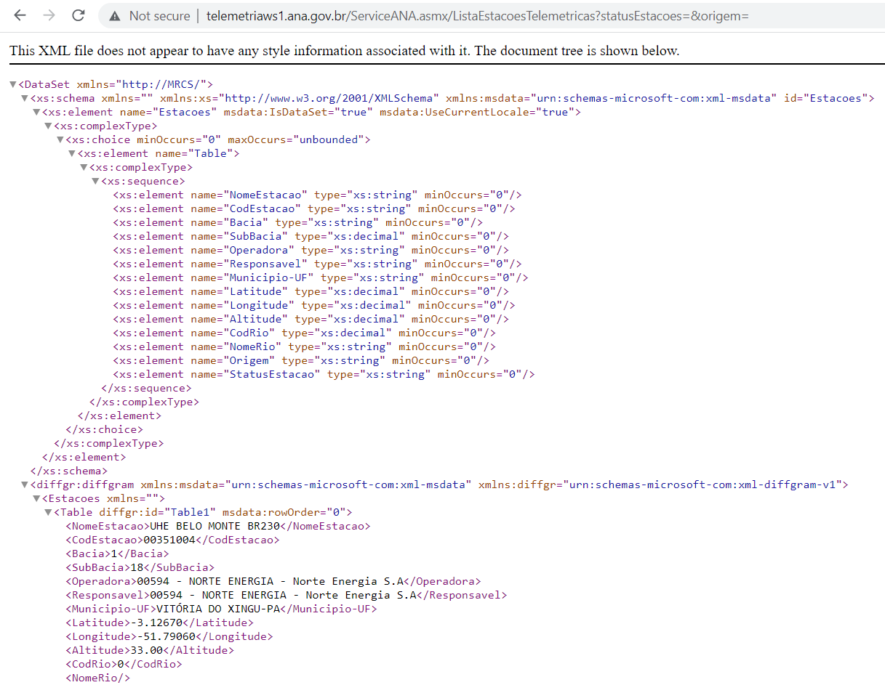
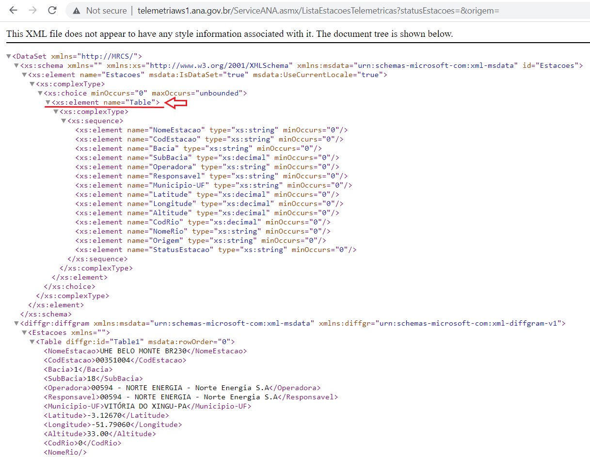

```{r setup, include=FALSE}
library(knitr)
library(XML)
library(dplyr)
```

## Repositório de dados

## Obtenção via webservice
Coletar informação da internet, também conhecido como "webscraping", é algo muito comum hoje em dia. A ANA (Agência Nacional de Águas e Saneamento Básico), o ONS (Operador Nacional do Sistema Elétrico) e muitos outros disponibilizam alguns de seus dados via o webservice. Isso, no fundo, é apenas um site contendo esses dados. Porém isso tudo é organizados de uma maneira bem específica. Portanto, a primeira coisa que precisa-se saber para utilizar um webservice é saber como essa organização é feita!

No caso do webservice da ANA, tudo isso está disponível no url <http://telemetriaws1.ana.gov.br/ServiceANA.asmx>.

Nele vemos todas as informações disponíveis, tais como "dados hidrometeorológicos", "dados hidrometeorológicos gerais", "lista de estações telemétricas", "Cotas", "inventário", "rios", "série histórica" e outros. Existe nesse site inclusive um arquivo em .pdf que fala melhor sobre o sistema como um todo e o que pode-se achar dentro dele <http://telemetriaws1.ana.gov.br/Telemetria1ws.pdf>! Esse arquivo é essencial para entendermos como os dados estão disponíveis e como podemos acessar eles.

Descobrimos então que os dados da ANA estão disponibilizados no formato XML ("Extended Markup Language") e com isso faremos os próximos passos. Não entraremos muito a fundo nesse formato e suas características, porém para quem quiser aprender mais sobre webscraping vale a pena dar uma olhada.

## Lista das Estações Telemétricas da ANA
Começaremos acessando os dados das estações telemétricas desse sistema. No próprio site é mostrado que é preciso de dois parâmetros para pesquisas as estações, um chamado de “statusEstacoes” que pode ser 0 (ativo) ou 1 (manutenção) e outro parâmetro chamado de “Origem” que pode variar entre 0 e 5. No arquivo .pdf citado acima, é comentado que se deixarmos o “statusEstacoes” em branco, serão retornadas as informações de todas as estações do sistema (o que queremos!). Assim, se colocarmos no nosso navegador o seguinte url: <http://telemetriaws1.ana.gov.br/ServiceANA.asmx/ListaEstacoesTelemetricas?statusEstacoes=&origem=>, teremos acesso ao arquivo XML com a informação de todas as estações telemétricas.

```{r XML_ANA_info_1, echo=FALSE, fig.align = 'center', out.width = "90%", fig.cap = ""}

```

Para abrirmos esse mesmo formato no RStudio, utilizamos uma função do pacote "XML" chamada xmlParse(). Essa função irá apenas ler um arquivo do tipo XML e vai gerar uma estrutura no R similar ao que aparece na imagem acima (formato de “árvore”). A função toma como argumento obrigatório o url a ser utilizado e um argumento opcional é a codificação do arquivo (do inglês encoding). Usualmente no Brasil utilizamos o “UTF-8” para poder utilizar nossos acentos (mas lembre-se que essa parte é um outro mundo no R e não entraremos com maiores detalhamentos).

```{r XML_no_R_ANA}
status_codigo <- ""
origem_codigo <- ""

url_base <- paste0("http://telemetriaws1.ana.gov.br/ServiceANA.asmx/ListaEstacoesTelemetricas?",
                   "statusEstacoes=", status_codigo, "&origem=", origem_codigo)
url_parse <- XML::xmlParse(url_base, encoding = "UTF-8")
```

Olha o nosso código um pouco. Percebe que invés de digitar diretamente o url para acesso, quebramos ele em várias partes e juntamos com a função paste0(). Fizemos isso para ficar mais fácil de mudar algo depois. Caso quisermos utilizar outro valor em “statusEstacoes” ou em “Origem”, basta mudarmos os objetos criados e o resto do código continua igual! Ao chamar o url_parse no console, verá uma imagem similar ao site quando abrimos o url.

Para puxar agora as informações dessas estações, precisamos entender melhor o arquivo original no formato XML. De maneira resumida, arquivos no formato XML ou HTML possuem estruturas que são definidas entre "< >". Ao mexer no url que nos dá todas as estações, percebe-se que todos os dados de cada estação são precedidos por um elemento chamado "Table" (dentro do "<>"). Porém, queremos os nodes que estão associados a esses "Tables" (tabelas). Para isso, samos a função getNodeSet(). Com os argumentos dessa função sendo primeiro o objeto criado no R depois de ter feito um xmlParse() e o segundo argumento sendo "//Table" (lembrar de colocar essas duas barras)

```{r XML_ANA_info_2, echo=FALSE, fig.align = 'center', out.width = "90%", fig.cap = ""}

```

A próxima etapa agora é transformar esse arquivo em algo que estamos mais acostumados a mexer dentro do R. Boas opções são dataframes e listas. Como não aprendemos a mexer muito com listas, vamos transformar nosso objeto em um dataframe. Para isso utilizamos a função xmlToDataFrame().

```{r XML_to_DF_ANA}
nodes_doc <- XML::getNodeSet(url_parse, "//Table")
cadastro_estacoes <- XML::xmlToDataFrame(nodes = nodes_doc)
```

Agora podemos fazer as manipulações que já aprendemos anteriormente (com dataframe ficou fácil!). Por exemplo, se quisermos selecionar apenas as estações de Brasília, escrevemos o código abaixo. O "Municipio-UF" é apenas uma das colunas do dataframe, podemos filtrar com base em qualquer outra também.

```{r Filtrar_cadastro_estacoes_ANA}
estacoes_bsb <- dplyr::filter(cadastro_estacoes, `Municipio-UF` == "BRASÍLIA-DF")
```
 
Lembrando que isso tudo nos dá apenas a lista com informações sobre as estações telemétricas. Para de fato termos acesso aos dados dessas estações, precisamos acessar outro url e fazer mais alguns códigos!

Idealmente, se a gente quiser ficar sempre puxando diferentes informações e não ficar precisando rodar linha por linha de código, podemos juntar tudo isso em uma função. Para a nossa função, deixaremos o processo um pouco melhor. Primeiro definiremos que a função precisa de 3 parâmetros (o status da estação, a origem e qual Unidade Federativa do Brasil queremos). Após puxar os dados em XML e transformar tudo em um dataframe, fazemos aqui algo novo - criamos uma coluna chamada "UF" contendo apenas as últimas duas letras do Município (isos porque no arquivo original, as duas últimas letras são as siglas da UF).

```{r Funcao_puxar_info_ANA}
ANA_info <- function(status_codigo = "",
                     origem_codigo = "",
                     UF_fun = "DF"){

  # Essas etapas foram vistas anteriormente
  url_base <- paste0("http://telemetriaws1.ana.gov.br/ServiceANA.asmx/ListaEstacoesTelemetricas?",
                     "statusEstacoes=", status_codigo,
                     "&origem=", origem_codigo)
  url_parse <- XML::xmlParse(url_base, encoding = "UTF-8")
  nodes_doc <- XML::getNodeSet(url_parse, "//Table")
  cadastro_estacoes <- XML::xmlToDataFrame(nodes = nodes_doc)
  
  # Aqui criamos uma coluna no dataframe apenas com nomes das UFs
  cadastro_estacoes$UF <- substr(cadastro_estacoes$`Municipio-UF`,
                                 nchar(cadastro_estacoes$`Municipio-UF`) - 1,
                                 nchar(cadastro_estacoes$`Municipio-UF`))
                                 
  estacoes_UF <- dplyr::filter(cadastro_estacoes, `UF` == UF_fun)

  return(estacoes_UF)
}
```

Podemos simplesmente testar essa função criada chamando a função e atribuindo para um objeto qualquer (chamamos aqui de "teste") seu resultado. Em seguida falamos para o R printar as colunas desse dataframe.
```{r teste_fun_puxad_info_ANA}
# Testar a função feita!
teste <- ANA_info()
colnames(teste)
```

## Dados Hidrometeorológicos da ANA
Para acessar os dados hidrometeorológicos nesse webservice, temos outro url: <http://telemetriaws1.ana.gov.br/ServiceANA.asmx?op=DadosHidrometeorologicos>. Nele, vemos que são necessárias agora três parâmetros para fazermos uma busca: o “codEstacao” (que a gente pegou na parte anterior!), a “dataInicio” e a “dataFim”. Do mesmo jeito de antes, vamos definir um objeto para cada parâmetro e depois criar um url baseado nesses parâmetros. Em seguida fazemos um xmlParse() e pegamos as informações contidas nos nodes com o getNodeSet(). Por último, transformamos isso em um dataframe. Dessa vez, podemos fazer a função direto ja!

```{r dados_hidro_ANA_1}
dados_ANA <- function(cod_estacao = "",
                      data_inicio = "01/01/2020",
                      data_fim = Sys.Date()){

  # Puxar dados do url e transformar em dataframe
  url_base <- paste0("http://telemetriaws1.ana.gov.br/ServiceANA.asmx/DadosHidrometeorologicos?",
                     "codEstacao=", cod_estacao,
                     "&dataInicio=", data_inicio,
                     "&dataFim=", data_fim)
  url_parse <- XML::xmlParse(url_base, encoding = "UTF-8")
  node_doc <- XML::getNodeSet(url_parse, "//DadosHidrometereologicos")
  dados_estacao <- XML::xmlToDataFrame(nodes = node_doc)
  
  return(dados_estacao)
}
```

A partir da função que criamos anteriormente, para puxar as informações das estações, podemos ver os códigos de todas as estações. Um exemplo é a FAL, da própria UnB. Seu código é 60478482 - podemos usar ele na nossa nova função "dados_ANA". Para ver o que essa função criada retorna, podemos pedir ao R as primeiras 6 linhas desse dataframe.

```{r dados_FAL_1}
dados_FAL <- dados_ANA(cod_estacao = 60478482)
head(dados_FAL)
```

Percebemos aqui um "problema". A data e a hora estão na mesma coluna e idealmente queremos deixar em colunas separadas (uma contendo a data e outra contendo as horas). Então iremos adicionar dentro da nossa função, mais um comando para fazer essa separação. Um jeito simples (mas não o único) de fazer isso é selecionando os primeiros 10 caracteres como sendo os de data e os últimos 8 como sendo de hora - porque a data sempre vai estar no formato "dia/mes/ano" e o horário em "hora:minuto:segundo". Podemos também reorganizar as colunas do jeito que quisermos. Abaixo está essa nova função mais organizada. 

```{r dados_hidro_ANA_2}
dados_ANA <- function(cod_estacao = "",
                      data_inicio = "01/01/2020",
                      data_fim = Sys.Date()){

  # Puxar dados do url e transformar em dataframe
  url_base <- paste0("http://telemetriaws1.ana.gov.br/ServiceANA.asmx/DadosHidrometeorologicos?",
                     "codEstacao=", cod_estacao,
                     "&dataInicio=", data_inicio,
                     "&dataFim=", data_fim)
  url_parse <- XML::xmlParse(url_base, encoding = "UTF-8")
  node_doc <- XML::getNodeSet(url_parse, "//DadosHidrometereologicos")
  dados_estacao <- XML::xmlToDataFrame(nodes = node_doc)
  
  # Separar data e hora
  dados_estacao$Data <- substr(dados_estacao$DataHora, 1, 10)
  dados_estacao$Hora <- substr(dados_estacao$DataHora, 12, 19)

  # Re-organizar a ordem das colunas do dataframe dados_estacao
  dados_estacao <- dados_estacao[,c(1, 6, 7, 3, 4, 5)]
  
  return(dados_estacao)
}
```

Chamamos novamente essa função (agora atualizada) para rodar a estação da FAL. Em seguida printamos no R apenas as primeiras 6 linhas desse dataframe.
```{r dados_FAL_2}
# Rodar a função para a estação da FAL
dados_FAL <- dados_ANA(cod_estacao = 60478482)
head(dados_FAL)
```

Aqui rodamos a função apenas para uma estação. Mas se quisermos rodar para várias estações, basta utilizar um loop (for) ou até mesmo a função lapply do R (mais rápido!).

## Outras formas
